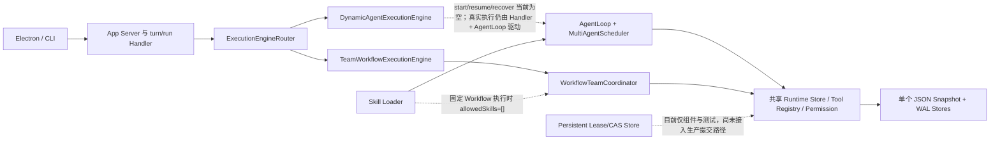

# God-Agent 全盘审计与下一阶段计划

> 审计日期：2026-08-19
>
> 审计基线：`main@ef197bad5f926035c9070a90b29e45eab6a244c7`
>
> 审计范围：单 Agent、动态父子 Agent、固定团队 Workflow、Tool/Skill/MCP、持久化与恢复、Electron UI、测试与容量、科研证据、CI 与发布工程。
>
> 总体结论：项目已经是一个有较强可靠性设计和自动化测试的“可运行研究原型”，但还不是 Codex 等级的通用 Agent Runtime，也还不足以直接支撑严谨论文结论。下一阶段应先补真实执行链与跨进程一致性，再做专家团和论文包装。

## 1. 本次审计裁决

### 1.1 成熟度

| 模块 | 当前成熟度 | 裁决 |
|---|---|---|
| 单 Agent Runtime | L2+：经过系统测试的工程原型 | 主链可用，具备 Context、Compaction、Tool、Skill、MCP stdio、权限、WAL 和恢复 |
| 动态父子 Agent | L2：功能原型 | 能并发委派、Review、Return 和父级续接，但调度与恢复所有权仍分散 |
| 固定软件团队 Workflow | L2+：受控场景原型 | V2 状态机、反馈恢复和终态收口较完整，但角色、顺序和工具策略硬编码 |
| 跨进程一致性 | L1：组件验证 | Lease/CAS Store 与测试存在，但没有接入真实 Job/Return/Model/Tool 提交链 |
| Electron 产品体验 | L2：可构建原型 | 核心交互和组件测试较多，但缺真实 Electron E2E、视觉回归和长任务稳定性验证 |
| 科研证据 | L1+：协议模拟与本机基线 | GATE 是确定性协议模拟；容量测试使用 Fake Provider，不能作为真实 Runtime/Provider 论文结论 |
| CI、安装与发布 | L1：本地工程 | 没有 CI、安装包、签名、自动更新、发布清单和可控 npm 打包范围 |

成熟度说明：L0 为概念；L1 为局部 Demo；L2 为经过自动化测试的原型；L3 为受控 Beta；L4 为可复现研究与生产级交付。

### 1.2 当前可以对老师说什么

可以严谨表述：

> God-Agent 是一个从零实现的本地 Agent Runtime 研究原型。它实现了单 Agent 主链、动态父子协作、版本化团队 Workflow、Model/Tool Invocation WAL、Return 幂等收据、人工处置 outcome_unknown、权限与 Workspace 沙箱，并通过 441 条全量测试。项目已经建立协议级确定性故障基准和本机 Fake Provider 容量基线，下一阶段正在把跨进程 Lease 接入真实执行链，并建设真实 Runtime 故障注入实验。

当前禁止表述：

- “已达到 Codex 完整能力”——没有官方内部实现证据，且项目仍缺通用 Workflow、真实 E2E 和生产运维能力。
- “已经实现端到端 exactly-once”——Provider 不提供统一的幂等键、查询和取消保证；跨进程 Lease 也尚未接入真实执行链。
- “GATE-100 证明真实 Runtime 成功率 100%”——当前 GATE-100 是协议级确定性模拟器，不调用真实 Runtime。
- “并发 4/8 就是线上容量”——容量结果来自当前机器、30 秒窗口和 Fake Provider。
- “已经具备可投稿论文实验”——尚缺真实 Runtime 对照、统计检验、长时间实验和外部复核。

## 2. 已完成且有证据的能力

### 2.1 Runtime 与可靠性

- Thread、Turn、Item 生命周期以及 JSONL/双向 JSON-RPC App Server。
- OpenAI Responses 流式输出、Reasoning Summary、Web Search 和 URL Citation。
- Context Builder、真实 Tokenizer、Item Budget、Context Compaction 和 Checkpoint。
- Tool Registry、Tool 权限审批、Workspace Sandbox、受控命令和 Tool Output 限流。
- Model Invocation WAL：`prepared -> submitted -> response_received -> committed`，不确定结果进入 `outcome_unknown`。
- Tool Invocation WAL：`prepared -> executing -> result_received -> committed`，副作用未知时禁止自动重放。
- `outcome_unknown` 的列表、人工处置、权限、审计和 Electron UI。
- Job、Task、Run、Evidence、Shared Board、Return/Receipt、Review 和有界返工。
- 固定软件团队 V2 Workflow 的恢复、用户反馈回注、责任节点状态和最终交付收口。

### 2.2 Tool、Skill 与 MCP

- 动态 Agent 使用共享 Tool Registry，通过 Profile、Job 配置和执行门禁计算最终权限交集。
- Skill Loader 支持发现、按需读取、路径逃逸防护和显式 Skill 上下文。
- MCP stdio 支持新旧协议发现、分页 `tools/list`、`tools/call`、超时、取消和 Tool Adapter。
- Tool 与 Skill 当前不会因为“两个 Runtime 同时存在”而天然冲突；主要风险来自生命周期所有权和权限策略不统一，而不是名称调用本身。

### 2.3 本次实际验证结果

| 验证项 | 结果 |
|---|---|
| `npm run check` | 通过 |
| `npm test` | 441/441 通过 |
| `npm run electron:build` | 通过，Renderer 产物约 281 KB，gzip 约 87 KB |
| `npm run test:electron` | 73/73 通过 |
| `npm run test:benchmarks` | 6/6 通过 |
| `npm run test:capacity` | 10/10 通过 |
| GATE-30/GATE-100 | 当前 commit 可确定性复跑；属于协议模拟，不是真实 Runtime E2E |
| Provider Smoke | 离线通过，`liveCalls=0`，未读取 Key、未产生费用 |
| 生产依赖审计 | 使用 npm 官方审计接口，0 个已报告漏洞 |
| Node Test Coverage | 聚合行覆盖 91.25%、分支 84.54%、函数 89.61%；该聚合包含测试文件，不能当成纯源码覆盖率 |
| npm 打包预检 | 约 3.1 MB、332 个文件，包含大量测试/文档，发布范围未收敛 |

## 3. 当前真实结构与摩擦点



当前两条链路在“路由”上已经分开：

- `analysis_only` / `software_change` 进入动态链，Root Turn 由 AgentLoop 控制。
- `software_product_delivery` 进入 Workflow 链，Root Turn 由版本化 Workflow 控制。

但它们还不是两套完全自治的 Runtime：

- 动态 Engine 的 `start/resume/recover` 为空，真实执行逻辑仍留在 App Server Handler。
- 两条链共享 Store、Tool Registry、Permission、持久化文件和进程资源。
- 共享基础设施本身是正确方向，但必须通过统一事务边界、Job Namespace、Quota 和 Lease 隔离，不能只靠调用顺序避免摩擦。

## 4. 不足清单

### 4.1 P0：不解决就不能称为可靠底座

#### P0-1 跨进程 Lease/CAS 尚未接入真实 Runtime

证据：

- `PersistentRuntimeLeaseStore` 只被自身测试引用，生产 `src/` 没有执行链调用。
- `AgentRuntimeCoordinator.withJobLock()` 明确写着当前只提供单进程 Job 串行化，未来才在 Return claim 前接持久 Lease。
- 容量测试中的 Lease 是独立探针，不等于 App Server 的 Job/Return/Model/Tool 已受到 fencing 保护。

风险：两个 God-Agent 实例可同时恢复或推进同一 Job；旧 Owner 的迟到提交可能绕过组件级 Lease。

必须做到：Job、Task、Return claim、Model commit、Tool commit、Workflow stage commit 全部接受并校验同一 Owner/Fencing Token；应用退出、崩溃、超时接管都有明确协议。

#### P0-2 动态父子 Agent 不是完整的独立 Execution Engine

证据：

- `DynamicAgentExecutionEngine.start()`、`resume()`、`recover()` 当前为空。
- 动态链实际由 `turn/run` Handler 直接调用 AgentLoop，Engine 只提供路由标签、取消和快照。
- `MultiAgentScheduler` 的 active、queue、activeByJob 和等待队列只存在内存中。
- 启动时只自动 `recover()` 软件团队 V2；动态 Return 明确等待用户再次 `turn/run`，丢失的动态 Task 没有统一自动恢复策略。

风险：表面上是双 Runtime，实际上动态链的生命周期所有权仍分裂在 Handler、AgentLoop、Scheduler 和 Store 之间；崩溃、取消、反馈和恢复容易出现边界不一致。

必须做到：Dynamic Engine 真正拥有 start/resume/recover/cancel/snapshot；Handler 只负责校验与转发；调度计划和恢复决策可持久化；每种中断都有“自动恢复、等待用户、人工处置、终止”四选一的确定性结果。

#### P0-3 科研 GATE 尚未执行真实 Runtime

证据：

- GATE Runner 调用 `research/benchmarks/src/engine.ts` 的确定性模拟状态机。
- 方法声明明确为 `deterministic-mock` 和 `logical simulated milliseconds`。
- 它没有启动 Electron/App Server，也没有调用真实 AgentRuntimeStore、Workflow、文件 Snapshot 或 Provider。

风险：模拟器与被研究系统同仓，可能只证明“设计的参考模型满足设计的规则”，不能证明真实实现满足规则。

必须做到：新增 Runtime-E2E GATE，真实构造 App Server/Store/Workflow，在持久化窗口强制 kill/restart；模拟 GATE 保留为 Model Check，不得替代实现验证。

#### P0-4 状态持久化仍是单 JSON 全量快照

证据：

- 每次保存会导出完整 Lifecycle、Run、Job、Task、Evidence、Return、Metrics、Requirement 和 Invocation Stores，再写临时文件并 rename。
- 当前有原子替换和进程内保存队列，但没有分区、增量日志、保留策略、备份轮换和损坏修复工具。
- 容量基线已观察到 2 ms 高压下持续吞吐衰减。

风险：项目扩大到专家团、长会话和大量证据后，全量序列化、扫描和文件增长会成为瓶颈；单文件损坏的恢复面过大。

必须做到：至少建立 Job 索引、Return/Task 直接索引、增量事件或分区快照、可审计归档、备份与校验恢复；在迁移前保留 v1-v6 兼容测试。

### 4.2 P1：决定能否发展成角色专家团和顺滑产品

#### P1-1 固定团队仍是硬编码 Demo

- 团队 ID 就是 `software-product-demo-team`。
- Product、Engineering、Quality、Lead、Orchestrator 的角色类型、阶段顺序、模型和工具均写在源码中。
- Requirement 只有三种 execution kind；团队 Workflow 只有 `software_product_delivery_v2`。
- 缺少可版本化的 Role Pack、Team Template、并行 fan-out/fan-in、投票/仲裁、动态专家选择和预算策略。

#### P1-2 固定 Workflow 当前禁用 Skill

- 固定角色 Profile 虽声明 `allowedSkills: ["*"]`，但 Workflow 调用 AgentLoop 时固定传入 `allowedSkills: []`。
- 因此动态父子 Agent 可以使用 Skill，固定软件团队不能使用 Skill。
- 这避免了当前阶段的越权，却无法支撑后续“角色专家团 + 专业 Skill 包”。

正确方案：Team Template 声明每个 Stage 的 Skill allowlist；Runtime 再与 Chat、Job、Profile 三层权限取交集，并对 Skill 版本和摘要做快照。

#### P1-3 Tool/MCP/Skill 只有共享注册，没有资源隔离

- 名称与权限交集可以避免大部分误调用，但没有每 Job 调用额度、并发额度、Provider 预算和 MCP Server 隔离舱。
- 固定 Workflow 的 Stage Tool 列表严格但静态；动态 Agent 的 `*` 能力较宽。
- MCP 只覆盖 stdio Tools，尚未覆盖 Streamable HTTP、Resources、Prompts、Sampling、Elicitation 和 OAuth。

#### P1-4 调度等待与取消仍不完整

- 依赖等待采用 5 ms 轮询；缺少事件唤醒、统一 deadline 和等待队列持久化。
- 多 Job 公平调度存在，但没有跨进程全局调度器、资源权重、模型速率限制和优先级反转治理。
- 需要验证父任务取消时，尚未获得执行槽位或等待依赖的任务能立即退出，而不是长期轮询。

#### P1-5 观测能力可查但不可运营

- Workflow 已记录 Stage Metrics，UI 能看到状态，但没有统一 Trace ID、结构化日志归档、指标导出、故障时间线和一键复现包。
- 动态链与 Workflow 链的指标模型不完全统一。
- 缺少“为什么父 Agent 没继续调用”的可解释决策记录：最后决策、阻塞资源、恢复条件、下一次尝试时间。

#### P1-6 UI 缺真实 E2E 与视觉门禁

- Electron 构建和 73 条模块测试通过，但大部分是 Controller、Reducer、源码结构或函数级测试。
- 没有自动启动桌面应用并完成真实点击、输入、滚动、反馈、崩溃恢复的 E2E。
- 没有截图基线、不同 DPI/窗口尺寸、长消息、1000 条历史记录和长时间流式输出验证。

#### P1-7 关键低覆盖模块需要专项补齐

本次覆盖报告中需要优先关注：

- `electron/renderer/desktop-reducer.ts` 行覆盖约 22%。
- `requirements/requirement-plan-writer.ts` 行覆盖约 25%。
- `runtime/runtime-session.ts` 行覆盖约 45%。
- `tools/shared-board-tools.ts` 行覆盖约 51%。
- `runtime/outcome-unknown-resolution-service.ts` 行覆盖约 61%。

覆盖率不是质量本身，但这些模块恰好位于 UI 状态、计划产物、恢复、共享数据和人工处置边界，应补状态转换与错误分支测试。

#### P1-8 真实 Provider 证据仍为空

- Provider Smoke 离线通过，但真实请求数为 0。
- OpenAI Responses 当前未接幂等键、请求状态查询和 Provider 取消；本地 Abort 只取消传输。
- 后续必须用单独预算、白名单模型、最大调用数和脱敏报告做小规模真实实验，不能把兼容网关当成统一语义。

### 4.3 P2：工程包装与发布质量

#### P2-1 README 和旧计划已经落后

- README 仍写“没有进入 Electron 或 Multi-Agent”和“165/165”，与当前 441 条测试和已合入能力冲突。
- `God-Agent-下一阶段详细执行计划-2026-08-18.md` 仍把 Lease、OutcomeUnknown、Provider、GATE 都写成未来阶段，但其中部分组件已经完成。
- `package.json` 中文 description 出现乱码。

#### P2-2 没有 CI 与质量门禁

- 仓库没有 `.github/workflows`。
- 没有 lint/format 命令、提交门禁、Windows/Linux 矩阵、构建产物校验和覆盖率阈值。
- 本地 441 条测试很强，但无法证明每个 PR 都自动运行过。

#### P2-3 安全和隐私仍缺完整产品方案

- 已有 Sandbox、权限、敏感字段脱敏，这是优点。
- Runtime Snapshot 会保存用户原文、代码、路径、模型文本和 Tool 业务结果，当前没有静态加密、OS Keychain、数据保留设置和“一键清除/导出”策略。
- 缺少 Threat Model、依赖锁定策略、Secret Scan、SBOM 和安全响应文档。

#### P2-4 安装与发布链不完整

- 没有 Windows/macOS 安装包、代码签名、自动更新、崩溃报告和版本升级回滚。
- `npm pack --dry-run` 包含约 332 个文件与大量测试/文档，缺少 `files` allowlist 或 `.npmignore` 收敛。
- `package.json` 声明 ISC，但仓库没有 LICENSE 文件；发布前必须补齐权利与引用边界。

## 5. 下一阶段实施计划

原则：先做可靠底座，再做专家团；先形成真实证据，再写论文结论；所有阶段均使用独立 `_hln` 分支/Worktree、小切片 PR 和不可变验收记录。

### Phase 0：事实基线与门禁整理（2–3 天）

目标：让仓库描述、脚本和自动验证与实际能力一致。

交付：

1. 更新 README 能力图、测试数、运行入口和不夸大声明。
2. 修复 package description 乱码；补 LICENSE、SECURITY、CONTRIBUTING。
3. 建立 CI：Windows 为主，Linux 验证协议层；运行 check、全量测试、Electron build、benchmark tests、capacity tests。
4. 加入 lint/format 和覆盖率采集；关键模块设置分支覆盖率门槛，不以全仓平均掩盖低覆盖模块。
5. 建立 `docs/status/` 单一事实源，旧计划标记 superseded，禁止多份进度互相冲突。

退出标准：新 clone 一条命令完成安装与验证；README 与 CI 数字一致；PR 无法绕过 P0 测试。

### Phase 1：统一 Runtime 所有权与真实跨进程 Lease（7–10 天）

目标：让动态链和 Workflow 链真正独立运行，同时共享安全的基础设施。

切片：

1. 定义 `ExecutionLeaseContext`：ownerId、leaseVersion、fencingToken、deadline。
2. App Server 启动为每个可推进 Job 获取持久 Lease；拿不到则只读展示，不得推进。
3. Dynamic Engine 接管 start/resume/recover/cancel；Handler 不再直接编排生命周期。
4. Return claim/consume、Stage checkpoint、Model commit、Tool commit 全部做 fenced commit。
5. Scheduler 的计划、等待原因与恢复决策持久化；用事件唤醒替代 5 ms 轮询。
6. 两进程真实竞争与 kill/restart 测试，不允许用独立 Lease 探针代替整链测试。

退出标准：

- 两个进程竞争同一 Job 1000 轮，重复提交、重复 Return、重复 Tool 副作用均为 0。
- 旧 Owner 迟到写入拒绝率 100%。
- 动态父子任务在排队、运行、Return ready、父 continuation 四个窗口被终止后，均能确定性恢复或明确进入人工处置。
- 自动恢复不得产生未授权模型调用。

### Phase 2：角色专家团通用底座（7–10 天）

目标：在不破坏单 Agent 和现有软件团队的前提下，支持可配置专家团。

核心模型：

- `RolePack`：角色说明、模型、推理强度、Tool/Skill/MCP 权限、预算、输出合同。
- `TeamTemplate`：版本、DAG、fan-out/fan-in、Review/仲裁、失败与反馈策略。
- `ExecutionNamespace`：Job 级 Store、Quota、Tool 调用和 Skill 版本隔离。
- `SupervisorDecision`：继续、重试、等待用户、替换专家、降级、终止；每次决策持久化原因与证据。

首批模板：

1. 软件研发团：产品、架构、后端、前端、测试、安全、负责人。
2. 科研团：问题定义、文献、方法、实验、统计、审稿人。
3. 轻量并行团：N 个独立专家 + 1 个 Reviewer，验证 fan-out/fan-in。

退出标准：不改核心源码即可新增角色与 Workflow；Stage 可安全选择 Skill；两个不同 Team 同时运行时 Tool、Skill、预算、文件 Claim 和状态互不串扰。

### Phase 3：存储、容量与可观测性（5–7 天）

目标：支撑长会话、专家团和可解释恢复。

交付：

1. Job/Task/Return/Evidence 直接索引，移除热点全表扫描。
2. Job 分区 Snapshot 或 Snapshot + 增量 WAL；增加校验、备份、归档和修复命令。
3. 统一 Dynamic/Workflow Metrics：queue、model、tool、review、feedback、recovery、lease、cost。
4. 每个 Job 生成可导出的故障时间线和最小复现包。
5. 30 分钟与 2 小时 Fake Provider soak；再做严格预算的 Provider-shaped 实验。

退出标准：100 ms Fake Provider 并发 4 在 30 分钟内无 Return 丢失/重复、无持续 RSS 上升、尾/头吞吐比不低于门槛；2 小时结果单独报告，禁止由 30 秒外推。

### Phase 4：Electron 真机 E2E 与细腻交互（5–7 天）

目标：解决“单测通过但实际点击不顺”的问题。

交付：

1. 自动启动 Electron 的 E2E：新建 Chat、发送、流式输出、取消、父子展开、反馈、恢复、历史、回收站、浏览器。
2. 截图视觉回归：100%/125%/150% DPI，窄/中/宽窗口，亮/暗主题。
3. 长内容：1000 条历史、超长 Markdown、连续 Tool Activity、父子树频繁展开收起。
4. 统一状态颜色与文案：灰色等待、橙色反馈/可恢复、红色唯一责任错误；任何状态只从结构化 Runtime 字段映射。
5. 性能门禁：输入延迟、滚动掉帧、首屏时间和大列表内存。

退出标准：关键 20 条真实桌面流程全绿；截图差异经过人工确认；连续运行 2 小时无 UI 假死和 running 动画泄漏。

### Phase 5：真实 Runtime 科研实验（7–14 天）

目标：把“协议模拟”升级为可用于论文和复试的实现证据。

实验分层：

1. Model Check：保留当前确定性 GATE 模拟器。
2. Implementation Check：实际 Runtime GATE-30/GATE-100，真实 Snapshot、Lease、WAL、Return 和 Workflow。
3. System Check：多进程 kill/restart、文件锁竞争、磁盘写失败、网络断开、429/5xx、Tool 副作用未知。
4. Controlled Live Check：用户单独批准预算后，真实 Provider 小样本；不与离线结果混表。

统计要求：

- 预注册研究问题、假设、指标和停止条件。
- 至少 3 个独立 seed/批次；对配对结果给出置信区间、McNemar 或 bootstrap。
- 消融必须真正关闭生产实现的 WAL/Lease/Recovery，而不是只修改模拟器变量。
- 报告 commit、机器、OS、Node、配置、原始 JSONL、结果 hash 和复现命令。
- 增加隐藏扩展集或外部人员新增场景，降低同仓 benchmark 过拟合风险。

退出标准：论文中每个主表数字都能从不可变原始数据一键重建；不手填结果；模拟、Fake、真实 Provider 三类证据醒目标注。

### Phase 6：安装、发布与复试交付（3–5 天）

交付：

1. Windows 安装包；macOS 构建可用后再做签名，不提前宣称支持。
2. npm `files` allowlist、版本策略、CHANGELOG 和可回滚迁移。
3. 5 分钟复试 Demo：正常协作、崩溃恢复、outcome_unknown、双进程竞争、实验报告。
4. 架构图、状态机、测试报告、科研经历日志、论文实验说明和不夸大声明。

退出标准：全新机器按文档完成安装、运行 Demo 和复现实验；演示不依赖开发者现场改数据。

## 6. 推荐执行顺序与总工期

| 优先级 | 阶段 | 建议工期 | 是否可并行 |
|---|---|---:|---|
| P0 | Phase 0 事实基线 | 2–3 天 | 可与 Phase 1 契约设计并行 |
| P0 | Phase 1 Runtime/Lease | 7–10 天 | 内部按文件所有权拆分，最终统一整合 |
| P1 | Phase 2 专家团 | 7–10 天 | 必须在 Phase 1 契约稳定后开始 |
| P1 | Phase 3 存储/观测 | 5–7 天 | 可与 Phase 2 后半段并行 |
| P1 | Phase 4 Electron E2E | 5–7 天 | 可与 Phase 3 并行 |
| P0/P1 | Phase 5 科研实验 | 7–14 天 | 必须基于冻结 commit |
| P2 | Phase 6 发布交付 | 3–5 天 | 最后收口 |

现实总工期：单人顺序执行约 6–8 周；3 个独立 Agent 并行且严格总控约 4–6 周。不能以增加 Agent 数量代替集成验收。

## 7. 每个阶段必须同步的四类文档

本审计文档是总控索引，后续每个 Phase 必须同步更新：

1. 需求文档：目标、范围、非目标、约束、验收标准。
2. 计划方案：架构、切片、文件所有权、风险、回滚点。
3. 测试用例：正向、反向、权限、恢复、并发、压爆、UI、真实环境。
4. 科研经历：问题、假设、方案选择、失败实验、原始证据、结果、反思和下一轮变化。

科研经历必须持续记录真实过程，不能在复试前倒推编造；每个结论都绑定 commit、测试命令和报告 hash。

## 8. 第一批建议拆分任务

### 任务 A：真实 Lease 接线

- 仅改 Runtime Lease 契约、App Server 恢复边界和 fenced commit。
- 不改 UI、专家角色和研究报告。
- 验收：双进程整链竞争，不是独立 Store 测试。

### 任务 B：Dynamic Engine 收口

- 把动态 start/resume/recover/cancel 从 Handler 收到 Engine。
- 持久化 Scheduler 恢复决策，清理 5 ms 轮询和隐式等待。
- 验收：动态子 Agent 四个崩溃窗口可恢复。

### 任务 C：Runtime-E2E GATE

- 保留现有模拟 GATE；另建真实实现 runner。
- 只使用冻结 fixture 和确定性 Fake Provider，不先调用付费 Provider。
- 验收：消融切换真实生产机制，原始报告可复现。

总控整合顺序：先冻结 Lease/Engine/Fault Injection 三个接口；A 与 B 分支分别通过专项测试后合入集成分支；C 最后绑定真实接口并给出 verdict。任何任务都不得自行修改另一个任务的所有权文件。

## 9. 最终 Verdict

God-Agent 现在最有价值的不是“界面像 Codex”，而是已经形成了 WAL、Return、Evidence、人工处置和版本化 Workflow 这些可研究的可靠性骨架。当前最大短板也很明确：跨进程 Lease 没有真实接线，动态 Engine 生命周期未收口，科研 GATE 仍是协议模拟。

因此下一步不应继续堆 UI 包装或急着写论文，而应按顺序完成：

```text
真实 Lease 接线
  -> Dynamic / Workflow 生命周期收口
  -> 通用专家团模板
  -> 真实 Runtime 故障注入
  -> 长时容量与小预算 Provider 实验
  -> 论文、复试 Demo 与安装发布
```

完成前三项后，这个项目才真正具备“可靠父子 Agent 底座”的说服力；完成真实 Runtime 实验与统计后，才具备投稿和高强度复试陈述的证据基础。

## 10. P0 首批任务执行追踪

> 2026-08-19 已按任务 A/B/C 建立三个独立 Worktree、分支和 PR。以下状态只表示各 PR 相对当前 `main` 单独可合并，不代表三个 PR 组合后可以跳过冲突处理和集成测试。

| 任务 | PR | Commit | 独立验证 | 当前状态 |
|---|---|---|---|---|
| A：真实 Lease 接线 | [#27](https://github.com/hanlaining/agent-learn/pull/27) | `c9a99de` | Lease 15/15；1000 轮竞争唯一 Owner；旧 Owner 4/4 拒绝；全量 441/441 | OPEN、CLEAN、MERGEABLE |
| B：Dynamic Engine 收口 | [#28](https://github.com/hanlaining/agent-learn/pull/28) | `b0630d5` | 动态/恢复 43/43；全量 447/447 | OPEN、CLEAN、MERGEABLE |
| C：Runtime-E2E GATE | [#26](https://github.com/hanlaining/agent-learn/pull/26) | `80b63a7` | 专项 7/7；旧基准 6/6；全量 448/448；baseline 30/30 | OPEN、CLEAN、MERGEABLE |

### 10.1 推荐集成顺序

1. 先审查并合并 #26。它只新增研究 Harness、测试和 package scripts，不修改生产 Runtime。
2. 再审查并合并 #27。它建立生产 Lease/Fencing 基座。
3. 暂不直接合并 #28；先在 #28 分支 merge 最新 `main`，解决 #27 带来的组合冲突。
4. #28 集成时重点审查 `package.json`、`src/app-server/main.ts`、`src/agents/agent-runtime-coordinator.ts`、`src/execution/team-workflow-execution-engine.ts`。
5. 在 #28 分支复跑类型检查、Lease 专项、Dynamic 专项、Runtime-E2E GATE、Electron 定向和全量测试。
6. 只有 GitHub 再次显示 `CLEAN / MERGEABLE` 且组合回归全绿，才允许最终合并 #28。

### 10.2 组合验收门槛

- Lease 仍保持 1000 轮竞争唯一 Owner，旧 Owner 迟到写拒绝率 100%。
- Dynamic Engine 恢复不得绕开 Lease，也不得在嵌套子 Agent/Workflow 中重复抢占同一 Job Lease。
- 五个动态崩溃窗口、Return claim/consume、父 continuation 和 Workflow stage 全部 exactly-once 收口。
- Runtime-E2E GATE 必须绑定合并后的生产接口，baseline 30/30，重复 Model/Tool 为 0。
- Provider exactly-once 仍不得声明；真实远端不确定结果继续进入 `outcome_unknown`。
- 不调用真实 API，不读取 Key，不产生费用，不提交生成报告或本机状态文件。
