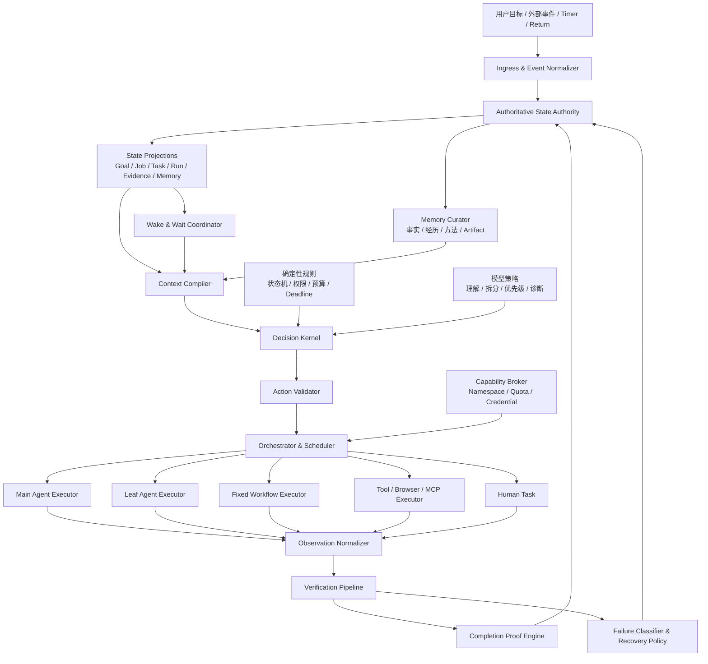

# God-Agent 中央大脑统一 Agent Runtime

## 副标题：从耐久执行底座走向任务契约、上下文编译、验证恢复与完成证明的闭环体系

> 文档编号：D07
> 文档类型：持续架构讨论 / Living Architecture Document
> 当前状态：Discussion Draft / 尚未批准实施
> 首次建立：2026-08-19
> 最近更新：2026-08-19T20:10:10+08:00
> 当前工程事实源：`<integration-worktree>`
> 用户提供的集成分支：`god-runtime-phase1-integration_hln`
> 用户提供的待验收对象：PR #31
> 用户提供的基线：`origin/main@dfc11ce9b20da3b087ec9a86daa9c78746423555`
> 上位讨论来源：`<legacy-checkout>/docs/Agent-Harness与Runtime-持续讨论.md`
> 维护原则：机制先于功能；事实先于包装；模型建议不能代替运行时事实；未经验证不得升级为结论

## 1. 文档目的

本文用于持续收敛 God-Agent 的最终产品、广义 Runtime、Agent Harness、执行环境和科研边界。

本文不是一次性实施计划，也不代表其中所有方案已经批准。后续讨论应优先修订正文中的长期结论，再在文末追加讨论日志，避免把同一架构维护成互相矛盾的多份事实源。

本文以最新 integration worktree 的实际实现为工程事实，不直接沿用旧 checkout 的实现结论。旧目录中的 Harness 文档只作为上位概念来源。

## 2. 当前最高层结论

God-Agent 不应被定义为普通工具调用框架、Codex 简化版或默认堆叠多个角色的多 Agent 系统。

更准确的定义是：

> God-Agent 是一个以 Task Contract 为目标函数、以权威持久状态为世界模型、以 Completion Proof 为停止条件，并能在主 Agent、叶子 Agent、固定 Workflow、工具和人工之间动态选择执行方式的耐久 Agent Runtime。

通俗解释：它需要持续、理智地判断现在该做什么、什么时候执行或等待、应该由谁完成、结果是否可信、失败后如何修正，以及依据什么证据确认总目标真的完成。

广义 Runtime 定义为：

```text
Runtime
  = Agent Harness
  + Orchestration
  + State Management
  + Execution Environment
```

核心闭环为：

```text
感知现状
  -> 理解目标
  -> 判断优先级
  -> 调度能力
  -> 执行验证
  -> 更新认知
  -> 再次决策或形成完成证明
```

模型、Tool、Skill、MCP、浏览器、Sandbox、主 Agent、子 Agent和固定 Workflow 都是中央 Runtime 可以调用的能力或执行器。中央 Runtime 才承担判断、约束、调度、等待、恢复和验证责任。

### 2.1 框架边界声明

当前文档提出的 State Authority、Task Contract、Context Compiler、Decision Kernel、Verification Pipeline 和 Completion Proof，是现阶段可落地、可验证的工程基线，不是对中央大脑最终形态的预设。

用户原话：

> 在不契合的框架中，你只是祥子，祥子到死都以为是自己拉车不够卖力

本项目不以复刻市面 Agent Framework 为目标。现有 Harness、Workflow 和 Multi-Agent 体系是参考实现、能力来源和实验基线；如果它们的对象边界无法表达“异构能力如何统一成一个持续个体”，允许重新定义基础对象、状态语义和闭环结构。

但“创造新框架”必须接受工程反证：

- 不能只替换术语而保持相同机制；
- 不能降低权限、安全、审计、恢复和证据要求；
- 必须能说明旧框架在哪个可复现实验中失效；
- 必须通过同模型、同工具、同任务的基线对照或消融实验证明收益；
- 在新框架尚未证明之前，当前耐久 Runtime 仍作为实验底座，而不是被提前推翻。

因此，当前更上位的研究对象暂定为：

> **Unified Cognitive-Action Runtime（统一认知—行动 Runtime）**：一套贯穿身份、目标、状态、权限、能力、行动、证据、记忆和演进的整体机制。

### 2.2 上位体系：统一智能有机体体系

用户原话：

> 更广义来讲这个东西应该是个体系 能够容纳躯干 器官的体系 你能明白我的意思么

据此再次修正边界：God-Agent当前研究和实现的是中央大脑体系的 **Software Organism Kernel（软件有机体内核）**，不是完整有机体体系本身。

```text
Unified Intelligent Organism System（UIOS）
  ├─ 主体、价值、治理与责任
  ├─ 躯干、资源网络和执行环境
  ├─ God-Agent广义Runtime：状态、神经、编排、执行、验证和恢复底座
  ├─ Controller / Harness：Runtime中的决策与约束中枢
  ├─ 器官：模型、Agent、Tool、Memory、Browser、Robot
  ├─ 免疫与自稳：权限、验证、隔离、恢复、降级
  └─ 生长演化：接入、评测、版本、灰度、淘汰和继承
```

因此本工程的边界是：先证明主体、目标、状态、器官契约、决策、验证和恢复能够形成软件小闭环；文明治理、物理躯干和长期自主演化仍是上位研究，不得被当前代码冒充为已经实现。

器官接入不能只使用Tool Registry语义。未来需要研究 **Organ Contract（器官契约）**，至少覆盖语义接口、权限、资源、健康信号、故障模式、验证、隔离、撤销、兼容、版本和责任来源。

## 3. “中央大脑”的正确理解

“中央”表示逻辑上存在唯一的运行时事实权威和完成裁决权，不表示把所有代码写进一个巨大类、一个永久 Prompt 或一个不可恢复的单进程对象。

推荐原则：

- 逻辑上集中：状态、决策版本、权限、预算和终态有唯一权威。
- 实现上模块化：Contract、Context、Scheduler、Executor、Validator、Recovery 和 Memory 分工明确。
- 执行上事件驱动：没有新事实时不空转调用模型。
- 故障上可恢复：重启后依赖持久事实，不依赖旧 Promise、Timer 或内存上下文。
- 完成上证据驱动：模型说“完成”不是完成事实。

父 Agent不是中央大脑本身。父 Agent属于 Decision Kernel 中的模型策略部分，可以理解目标、拆解问题和判断语义，但不能自行改写权威状态、放大权限或宣布 Job 完成。

## 4. 旧 checkout 与最新工程基线的关系

本轮只做了文件系统比较，没有执行 Git 操作。

比较 `src`、`tests`、`research`：

| 项目 | 旧 `<legacy-checkout>` | 最新 integration |
|---|---:|---:|
| 文件数 | 173 | 228 |
| 同路径但内容不同 | - | 159 |
| integration 独有 | - | 59 |

最新 integration 已新增或显著强化：

- 持久 Job Lease、Fencing 与执行所有权协调；
- Snapshot v7 generation/state capability CAS；
- Model/Tool Invocation WAL；
- `outcome_unknown` 处置服务；
- Dynamic Agent Execution Engine；
- Team Workflow V2；
- Return Outbox、Receipt 和 Stage Checkpoint；
- Process Chaos Harness；
- Runtime-E2E 和容量基准。

因此旧 checkout 中关于当前实现缺少这些能力的判断已经失效。Harness、上下文工程、验证闭环等概念结论仍然有效，但当前能力裁决必须以最新 integration 为准。

## 5. 当前 God-Agent 的四层能力映射

### 5.1 Execution Runtime

当前已有：

- WorkspaceSandbox 和路径逃逸防护；
- 文件读取、写入和目录列表 Tool；
- 预注册 Command Recipe；
- MCP stdio Client、工具发现、调用、超时与取消；
- Skill 发现和按需读取；
- Provider 调用与流式事件；
- Electron 应用壳和浏览器管理基础；
- Tool 参数 Schema、Permission Gate 和输出限制。

尚缺：

- 每 Job/Task 独立文件 namespace；
- 写任务 worktree/overlay 隔离；
- CPU、内存、进程、端口和网络配额；
- MCP request/session 的 Job 级隔离；
- Credential Broker；
- 浏览器执行能力与 Job/Task/Invocation 的完整归属；
- 对 `fileClaims` 的实际工具层强制。

### 5.2 Orchestration Runtime

当前已有：

- Thread、Turn、Job、Task、Run、Invocation、Return 等状态对象；
- Dynamic 与 Team Engine 的唯一执行路由；
- Task DAG、环检测、hard dependency 和文件 claim 冲突等待；
- 全局/Job 并发限制与基础公平调度；
- Return claim/consume Receipt；
- Stage Checkpoint、有界返工和反馈恢复；
- Job Lease/Fencing；
- Snapshot v7 CAS；
- 启动恢复默认零付费模型调用。

尚缺：

- 统一、持久的 Runtime Event Log；
- Command -> Event -> Projection 的单一写入协议；
- 持久 ready queue 和 Wake Registry；
- 重启后可重建的 Timer/Subscription；
- Scheduler 内存 queue 的事实化；
- 通用 fan-out/fan-in Workflow Template；
- 主 Agent、Leaf、Workflow、Tool、Human 的统一 Executor 选择协议；
- 统一的 Priority、Deadline 和 Recovery Policy。

### 5.3 Agent Harness

当前已有：

- Requirement 澄清、计划、修订、哈希和用户确认门；
- AgentLoop 的 Model -> Tool -> Model 基础闭环；
- ContextBuilder、Context Compactor 和 Checkpoint；
- Token/Item/Tool Round 预算；
- Agent Profile、Tool/Skill allowlist 和模型路由；
- 父子 Agent、Reviewer、Evidence 和 Shared Board；
- StageResult 严格输出合同；
- Failure Code、Failure Origin 和部分恢复策略；
- 最终格式修复和工具轮次耗尽收口。

尚缺：

- 机器可执行的 Task Contract；
- 面向不同决策目的的 Context Compiler；
- 统一 Decision Kernel；
- 模型 Action Proposal 的严格动作 Schema；
- 外部 Validator Registry；
- Completion Proof；
- 跨执行器统一的等待、恢复和停止语义；
- 认知状态中 Fact、Observation、Claim、Hypothesis 和 Decision 的区分；
- Memory 写入、失效、召回和污染治理。

### 5.4 Product / UI

当前已有：

- 多 Chat、历史、模型选择、权限模式；
- Agent 树与部分运行状态；
- 等待、反馈和错误的展示语义；
- Runtime 能力目录；
- Requirement 确认入口；
- Outcome Unknown 的用户处置入口。

尚缺：

- 中央 Runtime 当前决策原因；
- Goal、Contract revision 和 Completion Proof 展示；
- durable wait 的原因、唤醒条件和 deadline；
- Context Compiler 选择了什么、淘汰了什么；
- Evidence 与 acceptance criterion 的映射；
- Task 级 guide/retry/replace/stop；
- Capability 和 Quota 的可解释视图。

## 6. 当前最有价值的工程底座

当前最成熟、最适合继续积累科研证据的是耐久执行和故障一致性机制：

1. Model/Tool Invocation WAL；
2. Job Lease 与 Fencing；
3. Return Outbox/Receipt；
4. Snapshot v7 CAS/state capability；
5. `outcome_unknown` 人工处置；
6. Process Chaos Harness；
7. 取消后的迟到结果隔离。

这些机制已经超过普通 Tool Loop，但还没有自动组成中央大脑。它们更像中央 Runtime 的神经、血液和保护机制，仍需要统一的目标、状态、决策和完成裁决体系。

## 7. 当前最大的五个机制缺口

### 7.1 缺少单一权威状态协议

当前多个 Store 最终一起保存到单个 JSON Snapshot。Snapshot 提供原子文件替换和 generation 冲突检查，但不能完整记录状态变化的因果链。

主要问题：

- UI AgentEvent 是临时通知，不是持久事实；
- Job status、Dynamic phase、Workflow stage、Run status、Turn status 存在重叠；
- 部分状态直接写入，部分状态通过扫描其他对象推导；
- Dynamic drive context、Scheduler queue、Timer 和活动 Promise 仍存在内存事实；
- 不能统一回答“哪个 Command 基于哪个版本导致了哪次状态变化”。

目标不是立即引入大型数据库，而是先建立唯一写入协议：

```text
Command
  -> 校验版本、权限和不变量
  -> 追加持久 Event
  -> 更新 Projection
  -> 产生 Outbox / Wakeup
```

Snapshot 可以继续作为 Projection Checkpoint，但不再承担全部因果记录。

### 7.2 Requirement 尚未编译为可执行 Task Contract

当前 Requirement 已包含目标、范围、非目标、交付物、验收标准、测试和计划步骤，是很好的上层骨架。

仍缺：

- criterion 对应哪个 Validator；
- 输出 Artifact Schema；
- 输入来源和 freshness；
- sideEffectClass；
- Capability requirements；
- Budget 和 deadline；
- retry/replan/rollback/escalate 条件；
- 需要询问用户的条件；
- 允许哪些 Executor；
- 完成证明要求。

Dynamic `run_agent` 当前没有把完整 scope、requiredOutputs 和 acceptanceCriteria 暴露给父模型，实际子 Task 容易退化为“返回结构化结论”“结果可验证”等泛化默认合同。

### 7.3 ContextBuilder 尚未成为 Context Compiler

当前 ContextBuilder 主要按 Thread/Turn 组装历史，Context Compactor 负责摘要和 Token/Item 限制。

真正的 Context Compiler 应根据本次决策目的生成结构化 `DecisionFrame`：

```text
DecisionFrame = compile(
  GoalContract revision,
  当前 Task,
  权威状态切片,
  自上次决策后的新 Event,
  Evidence 与 freshness,
  失败和 attempt 历史,
  Capability catalog,
  剩余预算,
  相关规则与记忆,
  decision purpose
)
```

聊天历史只是输入之一。压缩摘要属于低信任派生上下文，不能升级为事实源。

### 7.4 Evidence bookkeeping 尚未形成 Completion Proof

当前已有 Evidence、Reviewer、StageResult 和终态一致性检查，但许多 Evidence 仍是模型自报的字符串。

主要问题：

- Dynamic Reviewer 通常只看到 Worker summary；
- Reviewer 默认无法独立读取代码、diff 或测试结果；
- acceptance criteria 没有逐条绑定 ValidatorResult；
- Artifact 缺少统一 digest、freshness 和 provenance；
- Requirement completed 主要来自 Job status 映射；
- 没有独立对象证明当前 Requirement revision 已闭环。

目标应是：只有 Completion Proof Engine 可以把 Job 判定为 completed。

### 7.5 缺少统一 Decision / Wait / Recovery Loop

当前：

- 普通 Turn 由 AgentLoop 推进；
- Dynamic 由父模型和 Dynamic Engine 推进；
- Team Workflow 由固定 Coordinator 推进；
- `outcome_unknown` 由独立处置服务推进；
- 等待分别由 Promise、状态、Return backoff 或人工再次调用表达。

中央 Runtime 需要统一闭环：

```text
新事实进入
  -> 状态归约
  -> 判断是否需要决策
  -> 编译 DecisionFrame
  -> 确定性规则 + 模型策略提出动作
  -> 动作校验
  -> 调度 Executor
  -> Observation 标准化
  -> 验证或失败分类
  -> 更新状态、认知和下一次 Wake 条件
```

## 8. 推荐目标架构

以下分层图是 **Reference Architecture（参考架构）**，用于实现雏形、定义边界和组织实验；它不是中央大脑不可改变的最终本体。未来可以重新组合模块，但必须继续满足本文的核心不变量，并以实验证据说明为何改变。

它现在进一步被定位为UIOS的软件有机体内核参考架构，不覆盖躯干、社会治理、物理资源循环和完整长期演化体系。



## 9. 模块责任边界

### 9.1 State Authority

唯一允许提交运行时事实的模块。

负责：

- 状态版本；
- Event sequence；
- 幂等键；
- 状态转换；
- Lease/Fencing；
- 终态不可逆；
- Outbox；
- Projection；
- 审计因果链。

模型、Worker、Reviewer、UI 和 Tool 只能提交 Command 或 Observation，不能直接把 Task 改为 completed。

### 9.2 Decision Kernel

负责“下一步做什么”，内部必须区分确定性规则和模型判断。

确定性机制负责：

- 身份与版本；
- 状态机；
- ready 判定；
- deadline；
- 权限和配额；
- 取消传播；
- 重试上限；
- 幂等；
- outcome_unknown；
- Completion Gate；
- 非法 Action 拒绝。

模型决策负责：

- 理解模糊目标；
- 任务拆分；
- 判断信息缺口；
- 选择优先级；
- 在合法候选中选择 Executor；
- 判断推理方向是否失效；
- 提出局部修复或重新规划；
- 综合证据形成用户可理解的结论。

原则：

> 模型提出动作，Runtime 校验并提交动作；模型输出本身不是事实。

### 9.3 Orchestrator / Scheduler

只负责何时、由谁、在哪里运行，不解释业务目标。

先做确定性资格过滤，再允许模型在合法候选中选择：

```text
Executor
  = Main Agent
  | Leaf Agent
  | Fixed Workflow
  | Direct Tool
  | Human
```

### 9.4 Execution Plane

负责实际模型、工具、浏览器、命令和文件执行。

它不能：

- 修改 Task Contract；
- 放大权限；
- 自行认领其他 Job 的 Return；
- 自行宣布完成；
- 把不可确认的副作用伪装成普通失败。

### 9.5 Verification Pipeline

Validator 应成为注册能力，而不是 Prompt 中的建议。

示例：

```text
validator://typescript/typecheck
validator://tests/targeted
validator://artifact/digest
validator://browser/final-state
validator://api/resource-query
validator://human/approval
validator://llm/rubric-review
```

每个 Validator 声明输入、输出 Schema、确定性等级、副作用、freshness、适用 criterion 和失败分类。

### 9.6 Completion Proof Engine

只有该模块可以把 Job 推入 completed。

`CompletionProof` 至少包含：

- Contract ID、revision 和 hash；
- 每条 acceptance criterion 的 ValidatorResult；
- 每个 deliverable 的 ArtifactRef 和 digest；
- 相关 Invocation/Evidence ID；
- 外部副作用的确定结果或处置记录；
- 剩余已知风险和未验证项；
- 最终状态版本；
- 生成者和时间。

开放式任务可以使用模型 Rubric，但必须标记为软证据。高风险任务仍需外部 Oracle 或人工确认。

### 9.7 Wait & Wake Coordinator

`waiting` 必须是耐久状态，不是函数仍在 `await`。

建议引入 `WaitSpec`：

```text
等待哪些 Event/Predicate
最迟到什么时候
由什么信号唤醒
超时后执行什么策略
是否需要查询外部状态
取消域属于哪个 Job/Task
```

等待类型至少包括：

- waiting_dependency
- waiting_return
- waiting_external_state
- waiting_permission
- waiting_user
- waiting_backoff
- waiting_resource
- waiting_review

重启后从 WaitSpec 重建 Timer/Subscription，不依赖旧 Promise。

### 9.8 Memory Curator

至少区分：

- Working Memory：当前 Job 的活动状态；
- Episodic Memory：历史事件和经历；
- Semantic Memory：经过验证、相对稳定的事实；
- Procedural Memory：已经验证的做事方法；
- Artifact Memory：文件、代码、报告、截图及 digest；
- User Preference：用户长期偏好和协作规则。

Memory Curator 决定什么值得写入、谁能修改、何时失效、何时召回以及召回内容是否进入模型上下文。

## 10. Task Contract v1 建议

建议把 Goal Contract 和 Child Task Contract 分开，但使用同一基础 Schema。

```text
TaskContract
  identity: contractId / revision / parentContractId
  objective: desired state change
  inputs: references + version + freshness
  outputs: artifact/result schema
  acceptance: criterion -> validator mapping
  scope: allowed / denied / nonGoals
  capabilityRequirements
  sideEffectClass
  executorEligibility
  dependencies
  priority / deadline
  token / tool / cost / process budget
  retry / replan / rollback policy
  wait / escalate / ask-user conditions
  completionProofRequirements
```

子 Task 必须继承或收紧父 Contract：

- 不能扩大 scope；
- 不能增加权限；
- 不能突破总预算；
- 不能删除父级 mandatory criterion；
- 新增副作用必须重新授权；
- Graph revision 不能静默抹除已经发生的外部动作。

## 11. Context Compiler v1 建议

第一版只支持四种明确用途：

1. `planning`：理解 Goal、缺失信息和可执行分解；
2. `execution`：执行单个 Task 所需的最小上下文；
3. `verification`：验收条件、产物、Evidence 和 Validator；
4. `recovery`：失败事实、已发生副作用、可选恢复动作和预算。

输出的 `DecisionFrame` 至少包含：

- decisionId / stateVersion；
- 当前 Goal/Task；
- 与完成标准之间的差距；
- 唤醒原因；
- 自上次决策后的新 Event；
- 已确认 Fact；
- 未验证 Claim/Hypothesis；
- 冲突信息；
- ArtifactRef/digest/freshness；
- 合法 Action 集合；
- Capability 和剩余预算；
- 被淘汰的上下文及原因。

Context Compiler 应尽量是纯函数。同样的权威状态和配置应产生可重复的结构化输出。

## 12. 认知状态模型

“更新认知”不能等同于追加聊天消息。

建议区分：

| 类型 | 含义 |
|---|---|
| Fact | Runtime 或外部 Oracle 已确认事实 |
| Observation | 一次执行观察，尚未完成解释 |
| Claim | 模型/Agent 提出的判断 |
| Hypothesis | 明确等待验证的假设 |
| Decision | 基于哪些事实做出的选择 |
| Evidence | 支持或反驳 Claim/criterion 的证据 |
| Artifact | 可定位、可校验的产物 |
| Memory | 经过治理后允许再次使用的记录 |

模型输出默认是 Claim，不是 Fact。只有 Validator、Runtime 确定性事实或受信任外部状态才能提升可信等级。

## 13. Executor 选择原则

中央 Runtime 不应默认创建子 Agent。

| 情况 | 推荐 Executor |
|---|---|
| 短任务、高上下文耦合、无需隔离 | Main Agent |
| 有确定 API、命令或算法 | Direct Tool |
| 输入输出边界清楚、可安全并行 | Leaf Agent |
| 需要独立上下文、特殊权限或对抗性审查 | Leaf/Reviewer |
| 步骤稳定、可预先定义、需要 checkpoint | Fixed Workflow |
| 产品取舍、敏感授权、不可查询副作用 | Human |

只有至少存在一种收益时才委派子 Agent：

- 上下文隔离；
- 安全并行；
- 专门能力；
- 独立验证；
- 权限隔离。

多 Agent 数量本身不是成功指标，也不是科研创新。

## 14. 核心对象严格定义

| 对象 | 严格含义 |
|---|---|
| Thread | 用户交互和展示历史的容器 |
| Turn | 一次交互事务，不等于长期任务 |
| Goal/Requirement | 用户确认的目标契约 |
| Job | Goal 的一次耐久执行实例 |
| Task | Job 内一个可验收的目标节点 |
| Agent | 能执行决策策略的逻辑身份/Profile |
| Run | 某 Executor 对一个 Task 的一次 attempt |
| Invocation | 一次 Model、Tool、MCP、命令或浏览器调用 |
| Event | 已持久化、不可变的运行时事实 |
| Observation | Executor 返回、等待解释的标准化结果 |
| Return | 子 Run 向所有者交付结果的可靠信封 |
| Evidence | 支持或反驳验收判断的记录 |
| WaitSpec | 耐久等待和唤醒合同 |
| DecisionRecord | 一次决策的输入版本、动作和依据 |
| CompletionProof | 证明当前 Goal revision 满足完成条件的闭包 |

## 15. 统一失败与恢复语义

| 失败类别 | 默认恢复动作 |
|---|---|
| 瞬时网络/限流 | 有界退避重试 |
| 参数或输出结构错误 | 局部格式/参数修复，不重复业务副作用 |
| 权限不足 | 选择低权限方案或等待用户 |
| 环境/依赖缺失 | 修复环境或更换 Executor |
| 上下文失效/污染 | 重新编译 Context，必要时建立新 Run |
| 原计划假设被推翻 | 局部 Replan 或新 Graph revision |
| Worker 质量不足 | 同 Task 返工或更换 Executor |
| 外部副作用未知 | 查询最终状态或人工处置，禁止盲重放 |
| Lease/Owner 丢失 | 从权威 Event/Projection 恢复，不相信旧回调 |
| Validator 不可用 | 等待、替代 Validator 或降级为人工，不得伪造通过 |

Recovery Policy 必须有最大 attempts、最大无进展决策数、deadline、预算和升级条件，避免循环失控。

## 16. 核心不变量

1. 模型输出不能直接修改权威状态。
2. Context 只是状态投影，不能反向成为事实源。
3. Executor 不能自行判定 Task completed。
4. Job completed 必须存在绑定当前 Contract revision 的 CompletionProof。
5. `WAITING` 必须有持久 Wake 条件或明确人工阻塞。
6. 未知副作用不得自动重放。
7. 子 Task 的权限、范围和预算只能比父 Contract 更窄。
8. 每个 Action、Observation、Evidence 和 Proof 都能追溯到 Job/Task/Run/Invocation。
9. 重启后不得依赖旧 Promise、内存 queue、Timer 或旧模型上下文恢复。
10. 多 Agent不是默认策略；委派必须有可说明的收益。
11. Fixed Workflow 与模型自主决策必须经过同一 State Authority 和 Completion Gate。
12. 终态与迟到结果竞争时，已提交的权威终态优先。
13. Model/Tool/Skill/MCP Registry 可以共享，Capability 实例、取消域和配额账本必须隔离。
14. 模型生成的 Claim 在验证前不得提升为 Fact。
15. 测试通过、代码存在、真实进程验证和生产可用必须分级陈述。

## 17. 对父子 Agent 方案的重新定位

此前父子 Agent 审计中关于同步 `run_agent`、摘要 Reviewer、文件 claim 和 Capability 缺口的判断仍然成立。

但父子 Agent不再是中央 Runtime 的上位架构，而是其中一个 Executor 组合：

```text
Central Runtime
  -> 判断是否值得委派
  -> 为 Leaf 编译 Task Contract
  -> 收紧 Capability
  -> 异步派发 Run
  -> 接收 Observation/Return
  -> 外部验证
  -> 决定接受、指导、返工、替换或终止
```

因此实施顺序不应是：

```text
先堆异步多 Agent
  -> 再补状态和验证
```

而应是：

```text
权威状态与耐久等待
  -> Task Contract
  -> Context Compiler
  -> Verification / Completion Proof
  -> Decision / Recovery Loop
  -> 将 Main/Leaf/Workflow/Tool/Human 接成 Executor
```

## 18. 分阶段落地路线

以下阶段在用户明确批准实施前均为 Proposed。

### Phase 0：冻结中央 Runtime 语义

只做设计、状态机、不变量、反例和验收标准。

产出：

- 核心对象定义；
- State Authority 写入规则；
- Task Contract v1；
- WaitSpec v1；
- CompletionProof v1；
- 确定性/模型责任矩阵；
- 故障模型；
- 非目标和范围上限。

### Phase 1：权威 Event 与耐久等待

目标：在不立即推翻现有 Store 的前提下，建立每 Job 的持久 Command/Event 边界和 Wake Registry。

退出门禁：

- 重要状态变化均可追溯原因；
- 重启不依赖旧 Promise/queue/Timer；
- UI Notification 与持久 Event 分离；
- 相同 Command 重放不重复产生事实。

### Phase 2：Task Contract v1

目标：把已确认 Requirement 编译成机器可执行 Contract。

退出门禁：

- criterion 绑定 Validator；
- scope 绑定 Capability；
- sideEffect、budget、deadline 和 escalation 明确；
- Dynamic 子 Task 继承或收紧父 Contract；
- 泛化默认验收条件不能把高风险 Task 推入 completed。

### Phase 3：Context Compiler v1

目标：支持 planning、execution、verification、recovery 四类 DecisionFrame。

退出门禁：

- 同状态输入产生可重复结构化输出；
- Fact、Claim、Evidence 和 stale data 明确区分；
- 省略内容有原因；
- 压缩摘要不被当成高权威事实。

### Phase 4：Verification 与 Completion Proof

先覆盖代码任务：

- 文件/Artifact digest；
- 类型检查；
- 目标测试；
- 构建；
- 必要的页面/API 最终状态；
- 未处置 failure/outcome_unknown。

退出门禁：Job completed 只能由当前 Requirement revision 的 Proof 推导。

### Phase 5：中央 Decision / Recovery Loop

引入结构化动作：

```text
EXECUTE
WAIT
VERIFY
RETRY
REPLAN
DELEGATE
START_WORKFLOW
REQUEST_HUMAN
FINALIZE
FAIL
PARTIAL
```

模型只在需要语义判断时唤醒，确定性推进不重复调用模型。

### Phase 6：Executor 统一接入

将现有能力作为 Adapter：

- AgentLoop -> MainAgentExecutor；
- MultiAgentScheduler -> LeafAgentExecutor；
- TeamWorkflowEngine -> WorkflowExecutor；
- Tool/MCP/Terminal/Browser -> CapabilityExecutor；
- 用户确认和处置 -> HumanExecutor。

该阶段再实现异步父子监督和通用 Team Template。

### Phase 7：Capability、持久化扩展和 Process Chaos

补齐：

- CapabilityGrant；
- Task namespace/worktree；
- 配额账本；
- MCP 隔离；
- 每 Job 分区/Event Journal；
- 新状态机 kill/restart；
- Dynamic 双 App Server 完整 E3。

## 19. 方案选择：自研还是引入外部编排 Runtime

### 方案 A：继续自研核心 Orchestration Kernel

优点：

- 能复用现有 WAL、Lease、Return 和 Snapshot；
- 研究机制和实验变量可控；
- 能形成真正理解状态与恢复的科研过程。

缺点：

- Durable Timer、Event、Projection、迁移和一致性成本高；
- 容易把项目范围扩成通用工作流平台。

### 方案 B：迁移到 LangGraph/Temporal 等外部 Runtime

优点：

- Durable wait、checkpoint、timer、retry 和可视化能力更成熟；
- 可减少基础设施施工。

缺点：

- 当前数据模型和恢复协议需要迁移；
- 外部框架语义可能压过本项目研究问题；
- 难以区分创新来自 God-Agent 还是底层框架；
- Temporal 对个人项目的运维和概念成本较高。

当前推荐：

> 暂不立即迁移。先冻结 Contract、Event、WaitSpec 和 CompletionProof 语义；用一个最小外部框架 POC 做对照，再决定哪些机制自研、哪些通过 Adapter 复用。

## 20. 科研定位

“中央大脑”适合作为产品和系统愿景，但论文不能研究整个中央大脑。

当前最成熟的论文主线仍建议保留：

> 面向长程 Agent Runtime 的崩溃一致性与副作用安全恢复。

现有 WAL、Lease/Fencing、Return Receipt、Snapshot CAS 和 Process Chaos 不应因架构愿景扩大而被放弃。

中央 Runtime 后续可以形成第二个窄研究问题：

> 在相同模型、工具和执行环境下，Task Contract + Context Compiler + Completion Proof 驱动的耐久 Harness，能否相对普通 Tool Loop 和同步多 Agent降低假完成率，并提高失败后的正确恢复率？

建议基线：

- B0：普通 AgentLoop；
- B1：当前同步父子 Agent；
- B2：耐久状态机，但无 Context Compiler/Proof Gate；
- Full：Contract + Compiler + Recovery + Proof。

建议消融：

- no-contract；
- no-context-selection；
- no-external-validator；
- no-failure-taxonomy；
- no-durable-wait。

主要指标：

- 真实任务成功率；
- False Completion Rate；
- Completion Proof 覆盖率；
- 恢复正确率；
- 重复/无效动作比例；
- 人工介入次数；
- Token、时间和费用；
- Context 有效信息密度。

## 21. 当前证据边界

本轮重新核对的专项：

- Requirement、Context、Snapshot、Outcome Unknown 和 Team Runtime：41/41；
- 前一轮父子/Dynamic/稳定性专项：64/64；
- Runtime-E2E：9/9。

限制：

- 没有调用真实 Provider；
- 64/64 和 41/41 主要属于 E2；
- Runtime-E2E 9/9 不能解释为 GATE-40 完成；
- Process Chaos 仍只能称 Team Workflow Return 窄范围 1/40；
- Dynamic 双 App Server 全矩阵未完成；
- Snapshot CAS 是本地单文件 CAS，不是数据库事务；
- 不得宣称端到端 exactly-once；
- 不得宣称中央大脑 Runtime 已经实现。

## 22. 当前已收敛与待讨论事项

### 22.1 已收敛原则

- 广义 Runtime 是 God-Agent 的上位架构。
- Harness 是带明确策略的 Agent Runtime，不等于狭义执行环境。
- 多 Agent和固定角色不是默认目标。
- 机制体系优先于功能数量。
- 模型建议不能成为权威事实。
- 完成必须证据驱动。
- 当前最强工程资产是耐久执行与故障一致性底座。
- 子 Agent、Workflow、Tool 和 Human 应统一为 Executor。
- 市面 Agent Framework 是参考和实验基线，不是中央大脑的最终边界。
- 当前模块分层是可验证的参考架构，不是不可改变的本体结构。
- God-Agent Runtime是统一智能有机体体系的软件内核种子，不等于完整体系。
- 器官必须具备契约、健康、隔离、替换、验证和责任机制，不能退化为普通插件列表。

### 22.2 尚待确认的关键决策

1. 是否接受“只有 Completion Proof Engine 可以判定 Job completed”为最高完成不变量。
2. 权威状态采用 append-only Event Journal，还是先用现有 Snapshot 增加 Command/Event 审计层。
3. Task Contract v1 首先只覆盖代码任务，还是同时覆盖分析和浏览器任务。
4. Context Compiler 第一版是否严格限制为四类 DecisionFrame。
5. MVP 是否只支持本地单机、单层 Leaf 和最多 4 个并发执行器。
6. 何时做 LangGraph/Temporal 最小对照 POC。
7. 中央 Runtime 研究问题是否保持为后续课题，不干扰当前崩溃一致性论文主线。
8. 哪些实验结果足以证明现有 Harness/Workflow 对“统一个体”问题存在结构性不契合，从而有必要引入新的基础对象或闭环结构。
9. Organ Contract应当统一Model、Tool、Agent、Memory和Robot，还是为不同器官类型保留专用契约并共享最小公共协议。
10. 哪些连续性是维持同一Runtime主体的必要条件，哪些组件可以替换而不改变主体身份。

## 23. 文档迭代规则

1. 已达成共识、预计长期成立的结论，直接修订正文。
2. 尚未验证的判断必须标记为 Proposed、Hypothesis 或 Open Question。
3. 被实现证据推翻的结论直接修订，并在讨论日志保留变更原因。
4. 每次架构讨论追加日期、问题、结论、反例和下一步。
5. 每次代码实施后更新“当前能力”和“证据边界”，禁止只更新路线图。
6. 本文负责中央 Runtime 的上位架构；D01–D05 继续分别负责需求、实施、测试、科研日志和论文路线。
7. 方案正式 Accepted 后，再同步 D01、D02、D03、D04，不提前把讨论稿写成已实现需求。
8. 所有数字必须绑定事实基线、环境、测试层级和限制条件。

## 24. 讨论日志

### 2026-08-19：从 Harness/Runtime 讨论收敛到中央大脑

讨论问题：God-Agent 是否只是父子 Agent Runtime，做好 Agent 是否本质上是做好 Runtime。

阶段结论：

- 如果 Runtime 使用广义定义，Harness 可以理解为带明确策略的 Agent Runtime。
- God-Agent 的核心不再是多 Agent数量，而是目标、状态、决策、执行、验证和恢复闭环。
- 父 Agent不是权威状态和完成裁决者，只是语义决策策略。
- 现有 WAL、Lease、Return、Snapshot 和 Process Harness 是中央 Runtime 的可靠性底座。
- 当前关键缺口是 State Authority、Task Contract、Context Compiler、Completion Proof 和统一 Decision/Wait/Recovery Loop。

### 2026-08-19：重新审计最新 integration 工程基线

审计范围：`<integration-worktree>`。

新增认识：

- 旧 `agent-learn` checkout 与最新 integration 差异显著，不能用于当前能力裁决。
- Requirement 已具备较强上层合同骨架，但未编译为机器可执行 Contract。
- ContextBuilder/Compactor 已支持历史、Checkpoint 和预算，但仍不是状态驱动的 Context Compiler。
- Evidence 和 StageResult 已存在，但 Completion Proof 尚未形成。
- 当前多套 Engine/Loop/Coordinator 尚未统一为中央 Decision Runtime。
- 先实现更多异步子 Agent不是正确的第一优先级。

负结果/纠正：

- “异步 Task Graph -> Supervisor”仍然偏向多 Agent，应让位于“权威状态 -> Contract -> Context -> Proof -> Decision Loop”。
- “Reviewer 是独立 Run”不等于拥有独立 Evidence。
- “有 Evidence 数组”不等于存在外部 Oracle。
- “Job 状态 completed”不等于已经形成可审计 Completion Proof。
- “等待中的 Promise”不等于耐久等待语义。

下一步：优先讨论并确认 Completion Proof 的最高完成不变量，再据此反推 Task Contract、Validator 和状态机边界。

### 2026-08-19 19:45:45 +08:00：明确市场框架只是参考架构

新增思想：中央大脑体系不必与市面 Agent Framework 使用相同的对象边界和组织方式。现有 Runtime 方案继续承担工程雏形和实验基线，但不再被视为最终本体。

用户原话原样保留：

> 在不契合的框架中，你只是祥子，祥子到死都以为是自己拉车不够卖力

架构影响：

- 把研究问题从“怎样继续扩展现有 Agent 框架”提升为“怎样让异构能力形成统一认知—行动个体”；
- 把当前目标架构标记为 Reference Architecture；
- 允许未来重新定义 Agent、Task、Memory 或 Runtime 的边界；
- 保留 State Authority、Evidence、Recovery、Permission 和 Completion Proof 作为新框架必须满足的最低约束；
- 要求新框架通过基线对照和消融实验证明必要性，防止以新术语掩盖不可验证的复杂化。

### 2026-08-19 20:10:10 +08:00：从中央Runtime上升为可容纳躯干与器官的体系

用户进一步明确：目标比广义Runtime更大，它应当是能够容纳躯干和器官的体系。

用户原话原样保留：

> 更广义来讲这个东西应该是个体系 能够容纳躯干 器官的体系 你能明白我的意思么

本轮收敛：

- 上位目标暂定为Unified Intelligent Organism System（统一智能有机体体系）；
- Runtime是其中的神经、状态和运行底座；
- Controller/Harness是Runtime中的决策与约束中枢；
- Model、Agent、Tool、Memory和Robot是不同类型的器官；
- God-Agent当前合理定位是Software Organism Kernel的软件实验种子；
- Task Contract、State Authority、Context Compiler和Completion Proof继续保留，并与新增Organ Contract、健康监控、隔离替换和主体连续性研究连接。

边界提醒：有机体类比不能被当作生命或意识的科学证据；当前仍应以单机、软件、低风险、可复现的机制实验为主。
