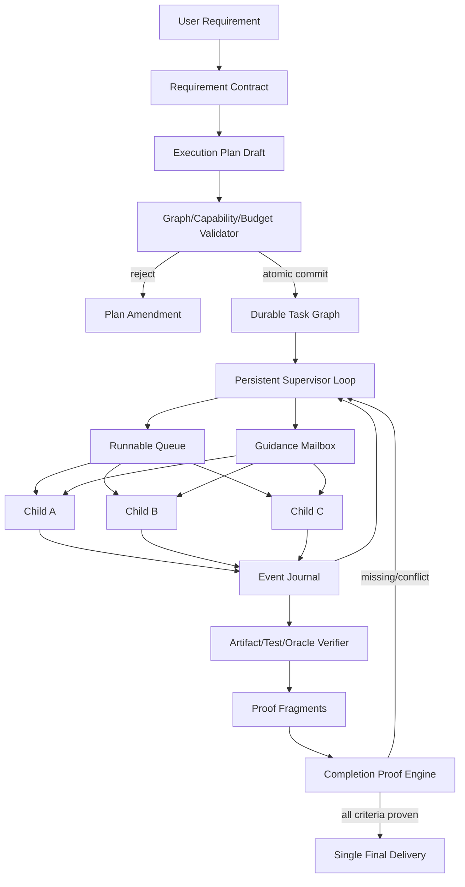
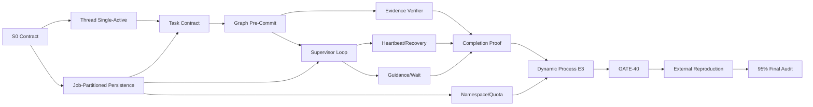

# God-Agent 双链科研版 Runtime 95% 完整度实施与验收计划

## 副标题：从可靠执行底座推进到可持续监督、可证明完成、可复现研究的 Runtime v1.0

> 文档状态：Proposed / 待总体验收
> 文档版本：v0.2.0
> 建立日期：2026-08-20
> 规划输入代码树：`origin/main@9a7ccefb1676fb7204d760461c43e83104890256`
> 当前集成工作树：`god-runtime-phase1-integration_hln@eed96e15bc55faeffeba84ca81bc5255e0ab7cd1`
> 代码树 SHA：`1154c58026a148d8abe3b16b521187d3406ef318`（两者一致）
> 当前工作树状态：Clean
> 本文性质：目标合同、实施拆分与验收方案；不代表其中能力已经实现
> 科研诚信边界：Process Chaos 仍为窄范围 `1/40`，不得表述为完整 E3、GATE-40、端到端 exactly-once、论文完成或生产可用

---

## 1. 计划要解决的问题

当前 God-Agent 已经具备多 Chat、Model/Tool WAL、Job Lease/Fencing、Snapshot v7 generation CAS、动态叶子子 Agent 并行、Task/Run/Evidence/Return 持久化、摘要 Reviewer、有界返工和固定 Team Workflow 恢复等能力。

但当前父子链实际仍是：

```text
父模型一次发出多个 run_agent
→ Runtime 用 Promise.all 等待全部叶子 Child
→ 摘要级 Reviewer 审查
→ Return/Receipt 持久化
→ 父模型继续汇总
```

它尚不能形成目标闭环：

```text
完整总目标合同
→ 完整 Task Graph 冻结
→ 并行执行与增量事件
→ 持续监督、指导、等待和恢复
→ Artifact/Test/Oracle 验证
→ Completion Proof 唯一裁决
→ 可复现证据与 SOP
```

本计划的目标不是继续堆角色、UI 或工作流，而是补齐上述 Runtime 执行语义。

---

## 2. “95% 完整度”的严格定义

### 2.1 95% 的分母

95% 指 **God-Agent 双链科研版 Runtime v1.0 冻结目标合同** 的加权完成度，不是：

- 代码覆盖率；
- 自动化测试通过率；
- 文档数量；
- Codex/Claude Code 功能复制率；
- 论文录用概率；
- 生产级多租户成熟度；
- “多个 Agent 能运行”这一单点能力。

### 2.2 评分公式

本计划保留 40 个 `RT95-*` 作为 Epic，但它们太大，不能直接评分。唯一评分分母是附录 A 的 **100 个原子 Work Package**：

```text
100 个 Work Package = 100 个工程评分原子 = 100 分
工程完整度 = Verified 原子数 / 100
```

| 状态 | 计分 | 含义 |
|---|---:|---|
| `Verified` | 1 | 生产接线、规定测试、原始证据和文档全部满足 |
| 其他状态 | 0 | Proposed、Accepted、In Progress、Implemented、Partially Verified、Failed、Unknown 均不得得分 |

`Implemented` 和 `Partially Verified` 仍可用于进度看板，但不能用于凑 95%。一个原子 Work Package 同时包含多个独立状态机或多个未通过 Oracle 时，必须继续拆分或保持 0 分。

### 2.3 领域权重和目标

| 领域 | 原子数/分值 | 当前审计参考 | 最低通过数 |
|---|---:|---:|---:|
| A. 单 Agent / 多 Chat 执行链 | 16 | 约 68% | ≥15/16 |
| B. 父子 Agent / Supervisor 执行链 | 28 | 约 44% | ≥27/28 |
| C. 权威状态、并发、恢复和迁移 | 18 | 约 59% | 18/18 |
| D. Capability / Namespace / Quota | 10 | 约 30% | ≥9/10 |
| E. Verification / Completion Proof | 12 | 低成熟 | 12/12 |
| F. 科研实验与可复现性工程门禁 | 10 | 约 66% | 10/10 |
| G. UI、文档和交接 SOP | 6 | 约 72% | 6/6 |
| **总计** | **100** | **双链核心约 52.5%** | **≥95/100** |

科研/SOP 另有附录 C 的 66 项独立子账本。工程总分不能补偿科研失败：科研领域只有达到至少 `63/66`、全部科研 P0 通过，F01～F10 才允许计为 Verified；论文 E4 还必须满足外部基线、正式统计、两次独立复现和完整 Artifact 保管链的合取门禁。

### 2.4 不允许平均分掩盖 P0 缺口

即使加权总分达到 95%，以下任一硬门禁失败，仍不得宣称 v1.0 达到 95%：

1. 同一 Thread 不能保证单活 Turn 或显式顺序语义；
2. Job Lease 与持久化写入粒度仍冲突；
3. Child 执行前没有持久化完整 Task Contract 和可验证 Task Graph；
4. Supervisor Loop 不能从持久事实恢复；
5. Reviewer 只能审摘要，不能验证 Artifact/Test/Oracle；
6. Requirement 的任一验收条件没有进入 Completion Proof；
7. 不可查询外部副作用被自动重放，而非进入 `outcome_unknown`/人工裁决；
8. 跨 Job 出现取消串线、结果错投、权限串用或状态污染；
9. Dynamic 双 App Server 关键进程故障矩阵未通过；
10. 外部复现者无法只按 SOP 重建证据包。

---

## 3. v1.0 产品边界

### 3.1 v1.0 必须达到

- 链路 A：多个 Chat 可独立并行，每个 Chat 有明确的 Turn 顺序、取消、工具、终端、上下文和恢复边界；
- 链路 B：父 Agent 可提交完整 Task Graph，Runtime 持续监督多个 Child，增量验证、指导、返工、恢复并形成唯一完成裁决；
- 两条链路共享能力实现，但不共享 Job/Turn 所有权、取消域、凭据域、路径域、配额和完成状态；
- 所有关键决定写入持久事实，崩溃后不依赖内存队列猜测恢复；
- 真实产物和测试证据成为完成条件，模型摘要只作为索引和解释；
- 形成可由外部人员执行的科研复现 SOP。

### 3.2 v1.0 明确非目标

- 不宣称完整替代 Codex、Claude Code；
- 不做任意层级的无限递归 Agent 树，v1.0 支持 `Parent → Leaf`，最多增加一个受控中间 Supervisor 层；
- 不做开放互联网多租户 SaaS；
- 不承诺 5000 Agent、跨地域调度或云原生弹性；
- 不保证不可查询外部副作用 exactly-once；
- 不在核心执行语义完成前扩充大量角色包、UI 动效或行业工作流；
- 不把 Fake Provider 结果外推为真实 Provider 的成本、延迟或稳定性结论。

生产级能力另建 v2.0 分母，不能通过缩小 v1.0 口径宣称“God-Agent 已生产可用”。

---

## 4. 推荐架构决策

### 4.1 Supervisor：模型常驻循环 vs Runtime 事件驱动循环

#### 方案 A：模型常驻并轮询 Child

优点：实现直观，模型可随时重新规划。
缺点：成本高、崩溃难恢复、判断不可重放，容易把确定性机制交给概率模型。

#### 方案 B：持久事件驱动 Supervisor，模型按决策点唤醒

优点：等待、超时、解锁、重试和恢复由确定性 Runtime 处理；模型只处理拆解、歧义、冲突和重新规划。
缺点：状态机和事件合同设计成本较高。

**推荐：方案 B。**

通俗解释：Runtime 负责“什么时候该醒、该等、该停”，模型负责“醒来后需要判断什么”。

### 4.2 Task Graph：边执行边创建 vs 两阶段提交

#### 方案 A：保留当前 `run_agent` 边调用边创建 Task

优点：改动小、模型使用简单。
缺点：无法预先证明完整性，同轮新 Task 难以互相引用，容易漏拆验收项。

#### 方案 B：`Plan Draft → Validate → Atomic Commit → Dispatch`

优点：可检查无环、验收覆盖、文件冲突、预算和权限，再开始任何副作用。
缺点：需要新增 Execution Plan/Task Contract 版本和迁移逻辑。

**推荐：方案 B。** 动态追加 Task 只能通过版本化 Plan Amendment 完成。

### 4.3 持久化：全局 Snapshot vs Job 分区

#### 方案 A：继续全局 Snapshot CAS，冲突后 reload/retry

优点：短期改动少。
缺点：不同 Job 仍互相竞争，全量重载/合并复杂，无法真正匹配 Job Lease。

#### 方案 B：共享目录下按权威域分区

```text
global/threads
jobs/{jobId}/state
jobs/{jobId}/journal
jobs/{jobId}/proof
leases/{jobId}
```

优点：Lease、CAS、恢复和故障影响域一致。
缺点：需要兼容读取 Snapshot v7，并设计单向迁移和回滚。

**推荐：方案 B。** 先实现兼容迁移，不立即引入数据库；论文阶段继续诚实表述为本地分区持久化，不表述为数据库事务。

### 4.4 Review：模型摘要裁决 vs 证据驱动验证

#### 方案 A：Reviewer 阅读 Worker Summary

成本低，但无法证伪文件、测试或外部状态是否真实完成。

#### 方案 B：确定性 Verifier 先生成 Proof Fragment，模型 Reviewer 再处理语义争议

**推荐：方案 B。** 摘要不得直接满足验收条件。

---

## 5. 目标 Runtime 信息流



确定性 Runtime 必须负责：状态转移、Lease/Fencing、等待、超时、依赖解锁、幂等、证据新鲜度、配额和完成门禁。
模型负责：目标拆解建议、语义判断、重新规划、冲突解释和无法自动验证时的升级建议。

---

## 6. 分阶段实施路线

参考工期基于“一个总控 Chat + 三个员工 Chat、每阶段独立 Review、无长期真实 Provider 实验”的假设。它是排期参考，不是日期承诺。

| 阶段 | 目标 | 参考工期 | 完成后预计总完整度 |
|---|---|---:|---:|
| S0 | 冻结 v1.0 需求分母、术语和验收矩阵 | 2–3 天（W0 已按合同关闭） | 不计工程 Verified |
| S1 | Thread/Job 分区、单活、兼容迁移和取消不变量 | 3–5 周 | 仅按真实 WP 重评分 |
| S2 | Task Contract 与完整 Graph 两阶段提交 | 2–3 周 | 仅按真实 WP 重评分 |
| S3 | Persistent Supervisor、Wait、Guidance、Heartbeat、Scheduler | 3–5 周 | 仅按真实 WP 重评分 |
| S4 | Artifact/Test/Oracle Review 与 Completion Proof | 2–4 周 | 仅按真实 WP 重评分 |
| S5 | Capability Namespace、Quota、观测与链路隔离 | 2–3 周 | 仅按真实 WP 重评分 |
| S6 | E3、Pilot/正式统计、外部基线/复现和文档闭环 | 4–8 周以上，受样本量与外部人员影响 | 满足合取门禁后才可能 ≥95% |

交叉审查后的诚实总参考工期约 16–28 周；若只有一个实现者串行推进，按 24–40 周或更长估算。外部复现人员和正式样本量会造成日历不确定性。离职前一周的现实目标不是完成 95%，而是冻结方法闭环、W1 ADR/执行合同和可独立接手的 SOP。任何阶段发现新的 P0 反例，完整度应下调而不是压缩测试时间。

---

## 7. 小需求拆分与验收

## 7.1 S0：目标合同与事实治理

### RT95-001：冻结 v1.0 Requirement Ledger

目标：把本文件的评分项拆入 D01，给每项唯一 ID、权重、证据等级和非目标。
验收：不存在“完整”“可靠”“支持”等无证据等级词；所有 95% 分母可机器统计。

### RT95-002：统一核心术语

必须严格区分：

- Thread：持久会话容器；
- Turn：一次用户输入到终态的执行窗口；
- Requirement：用户确认的总目标合同版本；
- Job：Runtime 管理的一次总目标执行实例；
- Task：持久逻辑工作单元；
- Run：某 Agent Profile 对某 Task 的一次执行尝试；
- Invocation：一次 Model 或 Tool 外部调用；
- Agent：`AgentProfile + AgentRun` 的运行实体，不是永久进程；
- Return：Child 向 Parent 投递的持久 Envelope；
- Evidence：事实证据；
- Completion Proof：Requirement 验收条件的可重放完成裁决。

验收：源码类型、D01–D04、日志字段和 API 不再混用 Parent、Agent、Run、Task、Return。

### RT95-003：建立需求—代码—测试—证据矩阵

验收：每项 `FR-*` 至少对应生产入口、正/反测试、证据等级和限制；无证据项保持 Proposed。

---

## 7.2 S1：基础并发、所有权和持久化

### RT95-101：同 Thread 单活 Turn

要求：同一 Thread 默认最多一个 `in_progress` Turn；第二个请求采用明确的 reject、queue 或 cancel-and-replace 策略。
验收：1000 次并发竞态无双活；崩溃恢复后不能遗留两个可继续 Turn；不同 Thread 仍可并行。

### RT95-102：Turn/Job 取消域隔离

要求：取消信号必须绑定 `{threadId, turnId, jobId, generation}`，迟到结果只进入审计事实。
验收：跨 3 Chat 并发取消、超时、迟到 Model/Tool 结果零串线。

### RT95-103：Job 分区持久化

要求：把 Job 权威状态、Journal、Proof 与 Lease 的冲突粒度对齐；保留 Snapshot v7 只读兼容和可回滚迁移。
验收：两个 App Server 各持有不同 Job Lease 可并行提交，无全局 generation 冲突；同 Job 仍由 fencing 阻止双写。

### RT95-104：权威状态和投影边界

要求：Lifecycle、Requirement、Job/Task/Return、Run、UI Projection 明确唯一权威；UI 状态不能反向决定完成。
验收：重启后仅从持久事实重建投影，结果与故障前语义一致。

### RT95-105：Event Journal 与幂等应用

要求：影响 Job/Task/Supervisor/Proof 的事件带 eventId、aggregateId、generation、causationId、correlationId。
验收：重复、乱序、迟到事件不能重复推进状态或错投其他 Job。

---

## 7.3 S2：Task Contract 与完整 Graph

### RT95-201：完整 Task Contract

每个 Task 至少包含：

- objective、scope、nonGoals；
- requiredOutputs；
- acceptanceCriteria；
- dependencies；
- capability grants；
- artifact namespace/file claims；
- token/time/process budget；
- deadline/wait policy；
- side-effect class；
- reviewer/oracle policy；
- parent Task/Requirement revision。

验收：生产入口不能用泛化默认验收条件代替用户合同。

### RT95-202：Execution Plan 两阶段提交

流程：`Draft → Validate → Commit → Dispatch`。
验收：未 Commit 的 Plan 不能启动 Child 或产生副作用；提交必须原子绑定 Requirement revision。

### RT95-203：Graph Validator

必须检查：DAG 无环、Task ID 稳定、依赖存在、验收条件覆盖、文件冲突、权限、预算、截止时间和并发上限。
验收：每类非法 Graph 至少有一个 fail-closed 反例。

### RT95-204：Plan Amendment

运行中新增、删除或重拆 Task 必须生成新版本，记录原因、旧新图差异和已产生副作用。
验收：旧版本事件不能推进新版本 Graph；已有不可逆副作用不能被静默抹除。

### RT95-205：Requirement Coverage Gate

验收：每个 Requirement acceptance criterion 必须至少映射一个 Task/Oracle；零 Task、漏拆或循环覆盖一律拒绝执行或拒绝完成。

---

## 7.4 S3：持续 Supervisor、等待和恢复

### RT95-301：Persistent Supervisor State Machine

建议状态：

```text
planning
→ validating_plan
→ dispatching
→ supervising
↔ waiting
↔ replanning
↔ recovering
→ proving_completion
→ completed | failed | cancelled | outcome_unknown
```

验收：每次迁移有持久事件、前置条件和 fencing；进程崩溃后能够从最后持久事实继续。

### RT95-302：Wake Registry 与等待语义

WaitSpec 至少包含：等待对象、唤醒事件、deadline、轮询策略、取消策略和超时动作。
验收：无忙轮询；依赖完成、人工回复、配额恢复、Tool 回调和 deadline 均能确定性唤醒。

### RT95-303：增量 Child 事件

要求：Child 的 started/progress/checkpoint/blocked/evidence/failed/completed 进入父 Job 事件流。
验收：任一 Child 完成即可触发验证并解锁下游，不必等待整批 `Promise.all`。

### RT95-304：Guidance Mailbox

要求：指导消息带版本、适用 Task/Run、有效期、优先级和消费 Receipt，只能在 Model/Tool 调用之间的安全边界生效。
验收：迟到指导、重复消费、错误 Run 消费均 fail-closed。

### RT95-305：Heartbeat 与执行者失联

要求：生产 Worker 周期性 heartbeat；Runtime 根据租约和进度区分慢、阻塞和失联。
验收：强杀 Worker 后，Supervisor 在有界时间发现并生成持久化恢复决策。

### RT95-306：副作用感知 Recovery Policy

分类至少包含：

```text
pure / read-only / queryable / idempotent / non-replayable
```

验收：pure 可重试；queryable 先查外部结果；idempotent 使用 key；non-replayable 进入 `outcome_unknown` 或人工裁决，禁止盲目重跑。

### RT95-307：可恢复 Scheduler

持久化 runnable/waiting 原因、优先级、deadline、公平性、dependency unlock 和 quota wait。
验收：重启前后调度可解释；不能以“丢弃内存 queue”作为正常恢复方案。

---

## 7.5 S4：真实验证与唯一完成裁决

### RT95-401：Evidence Contract

Evidence 必须包含来源、生成者、时间、对应 criterion、Artifact digest、执行命令/Oracle、退出码和新鲜度。
验收：Worker 自报 summary 只能作为索引，不能单独满足 criterion。

### RT95-402：Artifact Verifier

支持验证文件存在、路径 namespace、内容 digest、Diff 范围、禁止文件和交付物结构。
验收：伪造摘要、旧文件、越权路径和 digest 不一致均被拒绝。

### RT95-403：Test/Oracle Verifier

支持验证测试命令、退出码、报告、远端可查询状态和领域 Oracle。
验收：至少覆盖成功、测试失败、报告过期、外部状态不一致和不可查询五种情况。

### RT95-404：独立 Reviewer

Reviewer 读取 Proof Fragment 和受控 Artifact，不直接相信 Worker Summary；Reviewer 不能修改被审产物。
验收：Worker 与 Reviewer 权限域、模型上下文和 Run 身份隔离。

### RT95-405：Arbiter

当两个独立验证结果冲突、P0 安全问题或反复返工超过阈值时，创建独立 Arbiter。
验收：Arbiter 必须引用冲突证据，不允许只凭多数投票。

### RT95-406：Completion Proof Engine

Proof 至少包含：Requirement revision、Plan version、criterion→evidence 映射、未决副作用、失败反例、Reviewer/Arbiter verdict、Artifact digest 和最终 generation。
验收：全部 criterion 被有效证据覆盖且不存在 blocking contradiction，才允许进入 completed。

### RT95-407：Single Final Delivery

要求：Final Delivery 使用本地幂等键和 Receipt，严格限定为“唯一可见最终提交”，不得命名或外推为端到端 exactly-once。
验收：崩溃、重放和迟到 Return 下只产生一个已消费最终交付记录。

---

## 7.6 S5：Capability、Namespace、Quota 与观测

### RT95-501：Capability Grant

采用交集模型：

```text
Effective Grant
= Profile Grant
∩ Job Grant
∩ Task Grant
∩ Workspace Policy
∩ User Confirmation
```

验收：缺任一层授权即 fail-closed；Requirement/Task 层必须是真实生产接线，不得只写文档。

### RT95-502：Namespace

至少隔离 Tool、Skill、MCP Server、Credential、Workspace/Worktree、Terminal Process 和 Artifact 路径。
验收：跨 Job 路径、凭据、MCP 结果和 Tool Result 错投攻击矩阵全部拒绝。

### RT95-503：Quota 与背压

至少实现每 Job/Task 的 token、时间、并发 Tool、进程数、输出字节和磁盘 Artifact 配额。
验收：单一 Chat 资源耗尽不会拖垮其他 Chat；超配额进入明确 waiting/failed 状态。

### RT95-504：公平调度

验收：一个包含大量 Child 的 Job 不能无限饥饿其他 Job；记录队列等待时间和配额拒绝原因。

### RT95-505：可观测性

必须可按 threadId/turnId/jobId/taskId/runId/invocationId/correlationId 查询事件；敏感数据默认脱敏。
验收：任何失败都能定位到合同、执行、证据和恢复决定，且日志不会泄露凭据。

---

## 7.7 S6：科研、复现和 SOP 闭环

### RT95-601：修正实验构念

将当前 `taskSuccess` 拆成：

- safety/protocol handling success；
- business completion；
- outcome known；
- outcome unknown；
- duplicate external effect。

验收：不能再出现“taskSuccess 100% 同时 outcome_unknown > 0”而无解释的指标。

### RT95-602：完整消融

至少包含：

```text
full
no-model-wal
no-tool-wal
no-lease
no-receipt
no-supervisor-recovery
no-completion-proof
no-human-resolution
```

验收：每个消融只移除一个机制，输入和随机种子一致。

### RT95-603：Dynamic 双 App Server E3

覆盖 commit 前、提交中、结果后、Return claim、Receipt、Proof commit 等关键故障边界。
验收：预注册矩阵全部通过；迟到执行者被 fencing；不可查询副作用不被伪装为成功。

### RT95-604：完成 GATE-40

按预注册的 8 个窗口 × 5 个 seed 执行，保存全部成功与失败原始结果。
验收：不得只保存汇总报告；任何一次失败必须进入 D04，并决定修复、降级 Claim 或接受限制。

### RT95-605：统计分析

至少报告失败率、恢复率、误完成率、重复副作用率、P50/P95 恢复时间、95% 置信区间和效应量。
验收：不能只用单次比例或测试数量代替统计结论。

### RT95-606：外部无指导复现

由未参与开发者在另一台机器或新 VM，仅依据仓库、baseline SHA 和 SOP 完成三层实验与 Manifest verify。
验收：保存复核者、源码/lockfile SHA、环境、精确命令、起止时间、退出码、stdout/stderr、投影 SHA、人工介入和签名。

### RT95-607：证据保管链

将顶层 Artifact README、Clean Reproduction、失败日志和投影文件纳入顶层 Manifest。
验收：冻结包内所有对 Claim 有影响的文件均可验证完整性。

### RT95-608：文档一致性门禁

验收：README、D00–D11、Claim Matrix、Artifact baseline、Snapshot 标签和测试数量不存在互相冲突的“当前事实”。历史结论必须带日期/版本，不覆盖负结果。

---

## 8. 三个员工 Chat 与总控分工

每一阶段最多并行三个员工 Chat。员工只在各自批准的 worktree/分支工作，总控负责需求冻结、交叉 Review、集成测试和唯一 PR；禁止多个 Chat 同时修改同一权威文件。

| Chat | 长期职责 | 主要需求 | 禁止越界 |
|---|---|---|---|
| Runtime 智囊/实现 Chat | 状态、并发、持久化、Supervisor | RT95-101～307 | 不自行改变科研 Claim |
| Verification/Capability Chat | Proof、Reviewer、Namespace、Quota | RT95-401～505 | 不修改 Runtime 状态语义而不提 ADR |
| Research/SOP Chat | Harness、统计、Artifact、文档一致性 | RT95-601～608 | 不为通过实验修改生产语义 |
| 总控 Chat | Requirement、ADR、Review、集成和最终裁决 | RT95-001～003；所有 Gate | 不把员工“完成”直接当成 Verified |

### 8.1 每个员工任务的强制 Task Contract

每次派发必须写清：

1. 目标和非目标；
2. 允许修改的文件；
3. 禁止修改的文件；
4. 前置依赖；
5. 生产不变量；
6. 正向、反向、并发、恢复测试；
7. 验收命令；
8. 预期证据路径；
9. 回滚点；
10. 不得夸大的表述。

### 8.2 总控验收顺序

```text
员工自测
→ 独立 Reviewer 静态审查
→ 针对性攻击矩阵
→ 总控全量回归
→ 真实进程门禁（适用时）
→ 文档/证据更新
→ 才允许提交 PR
```

员工 Chat 无权自行 Merge。总控必须核对工作树、目标分支、文件清单、测试结果和科研表述后，才能请求用户批准 Git 操作。

---

## 9. 依赖关系与并行顺序



禁止为了并行而打破这些依赖。例如 Completion Proof 不能在 Task Contract 和 Evidence Contract 未冻结时先写；Process Harness 不能用模拟状态代替未实现的生产 Supervisor。

---

## 10. 分层验收门禁

### G0：合同门禁

- 需求 ID、权重、验收和非目标已冻结；
- 架构选择记录 ADR；
- 状态迁移和故障模型明确；
- 不允许先编码再补定义。

### G1：组件门禁 E2

- 类型检查、单元和集成测试通过；
- 正向、反向、重复、乱序、取消、超时用例齐全；
- 新增状态必须有序列化、迁移和恢复测试。

### G2：Runtime 生产接线门禁 E2

- 测试直接走 App Server 的生产组装入口；
- 不允许只在 Test Double 中存在；
- Fake Provider/Tool 必须明确标注。

### G3：真实进程门禁 E3

- 真实启动、强杀、重启两个 App Server/Worker；
- 覆盖预注册 commit boundary；
- 检查残留进程、端口、状态和 Artifact；
- 保存完整原始日志。

### G4：科研复现门禁 E4 候选

- Frozen Artifact 与顶层 Manifest；
- 外部无指导复现；
- 重复实验、统计、消融；
- Claim–Evidence Matrix 和限制同步。

### G5：总体验收

必须同时满足：

1. 加权完整度 ≥95%；
2. 第 2.4 节十项硬门禁全部通过；
3. D01–D04 同步更新；
4. D04 包含全部新负结果；
5. 全量门禁无回归；
6. 工作树和 Artifact 可追溯到唯一 commit；
7. 第三方按照 SOP 能复现；
8. 对外表述没有超过证据等级。

---

## 11. 故障模型与必须证明的不变量

### 11.1 故障模型

- Model/Tool 提交前、提交中、响应后崩溃；
- App Server、Worker、Reviewer、Supervisor 强杀；
- 重复、乱序、迟到事件；
- Lease 过期、时钟漂移、有主权进程停顿；
- Snapshot/Journal 写入冲突和部分写；
- Child 阻塞、超时、失联或输出格式错误；
- Artifact 缺失、过期、被替换或越权；
- 外部副作用可查询、幂等或不可查询；
- 多 Chat/Job 争夺 CPU、进程、Token 和工作区；
- 人工回复迟到、重复或与 Plan revision 不一致。

### 11.2 核心不变量

1. 一个 Thread 在默认策略下最多一个可推进 Turn；
2. 一个 Job generation 只有当前 fencing owner 可提交；
3. 已取消/失权 Run 的迟到结果不能推进业务状态；
4. 未提交的 Plan 不能执行；
5. 未满足依赖的 Task 不能变为 runnable；
6. Capability 只能收窄，不能由 Child 自行扩大；
7. Evidence 必须绑定 criterion、Plan revision 和 Artifact digest；
8. Summary 不能单独构成完成证据；
9. 不可查询副作用不能被自动重放为成功；
10. Proof 不完整时 Job 不能 completed；
11. Final Delivery 最多产生一个被接受的本地 Receipt；
12. 任一 Chat/Job 的取消、结果、凭据和配额不能影响其他 Job；
13. 崩溃恢复只使用持久事实，不依赖丢失的内存队列；
14. 任何科研 Claim 都能追溯到 commit、命令、原始结果和限制。

---

## 12. 科研课题收口

### 12.1 推荐主研究问题

> 在进程崩溃、迟到结果和不可查询外部副作用条件下，持久化父子 Agent Runtime 如何通过 Task Contract、Lease/Fencing、Return Receipt、事件驱动 Supervisor 与 Completion Proof，降低误完成和重复副作用，并实现可恢复的总目标裁决？

### 12.2 基线与消融

- Baseline 1：当前批量 `Promise.all + summary review`；
- Baseline 2：无持久 Supervisor；
- Baseline 3：无 Completion Proof；
- Full：本计划 v1.0；
- 机制消融：见 RT95-602。

### 12.3 核心指标

- false completion rate；
- duplicate external effect rate；
- outcome_unknown 暴露率；
- recovery success rate；
- completion proof coverage；
- mean/P95 recovery time；
- supervisor decision count；
- token、时间和持久化开销；
- 外部复现成功率和人工介入次数。

论文创新不能表述为“使用了多个 Agent”。研究贡献应落在故障模型、持久协议、监督恢复、完成证明及其实验反例上。

---

## 13. 离职前必须完成的交接包

离职前不追求实现全部 95%，优先确保后续可以继续推进：

1. 用户确认本文的 v1.0 分母、非目标和硬门禁；
2. 把 RT95 需求写入 D01，把阶段写入 D02，把门禁写入 D03；
3. D04 记录本次三智囊团审计、当前分数、反例和方案选择；
4. 冻结当前最新代码树、测试结果、Artifact 和文档漂移清单；
5. 建立每个小需求的可复制 Task Contract 模板；
6. 建立三个员工 Chat 的文件所有权和交接顺序；
7. 先完成一次真正的外部无指导 SOP Pilot，暴露交接歧义；
8. 所有未完成项保持 Proposed，不用空接口或文档措辞伪装进度。

完成这一交接包后，即使原开发者离开，后续执行者仍能知道：做什么、为什么做、在哪个边界停、如何证明、失败后记录在哪里。

---

## 14. 风险与范围控制

| 风险 | 预警 | 控制措施 |
|---|---|---|
| 为追 95% 扩大分母或偷偷缩小分母 | 分数快速上升但 P0 未闭 | 分母冻结，变更必须新 Requirement revision |
| 多 Chat 同时修改状态核心 | 合并冲突或语义不一致 | 文件所有权；状态合同由总控先冻结 |
| 测试替身能力强于生产接线 | Test 通过但真实入口不存在 | G2 强制生产组装入口 |
| Supervisor 全交给模型 | 成本高、不可恢复 | 确定性 Runtime + 决策点唤醒模型 |
| Reviewer 相信摘要 | 误完成率被隐藏 | Artifact/Test/Oracle Proof Fragment |
| 为赶工跳过 E3 | 组件通过即宣称可靠 | P0 必须包含 Dynamic 双进程矩阵 |
| 科研只保留成功结果 | 无法复核真实过程 | D04 和 Artifact 同时保留负结果 |
| 过早做 UI/角色包 | 主链仍不可靠 | S0–S6 完成前冻结非核心扩展 |
| 不可查询副作用重复执行 | 外部状态被破坏 | side-effect class + outcome_unknown + 人工裁决 |
| 95% 被误解为生产完成 | 对外表述夸大 | v1.0 与生产 v2.0 分母完全分离 |

---

## 15. 最终验收表

总控在宣称“达到 95%”前必须逐项签署：

| 验收项 | 状态 | 证据位置 | 审核人 |
|---|---|---|---|
| v1.0 分母和权重已冻结 | Proposed | 待填写 | 待填写 |
| 链路 A ≥95% | Proposed | 待填写 | 待填写 |
| 链路 B ≥95% | Proposed | 待填写 | 待填写 |
| 状态/恢复内核 ≥97% | Proposed | 待填写 | 待填写 |
| Capability/Quota ≥90% | Proposed | 待填写 | 待填写 |
| Proof/观测 ≥95% | Proposed | 待填写 | 待填写 |
| 科研复现 ≥95% | Proposed | 待填写 | 待填写 |
| SOP ≥95% | Proposed | 待填写 | 待填写 |
| 十项 P0 硬门禁全部通过 | Proposed | 待填写 | 待填写 |
| Dynamic 双 App Server E3 通过 | Proposed | 待填写 | 待填写 |
| GATE-40 完成 | Proposed | 待填写 | 待填写 |
| 外部无指导复现完成 | Proposed | 待填写 | 待填写 |
| D01–D04 与 Claim Matrix 同步 | Proposed | 待填写 | 待填写 |
| 所有负结果已归档 | Proposed | 待填写 | 待填写 |
| 最终加权总分 ≥95% | Proposed | 待填写 | 待填写 |

只有所有硬门禁通过、总分达到 95% 且证据可复核，状态才可以从 `Proposed` 更新为 `Verified`。

---

## 16. 当前阶段结论

本计划已经把“完善到 95%”从模糊愿望转换为可计算、不可被测试数量掩盖的目标合同。当前代码仍处于可靠执行底座和动态叶子调度器阶段，本文中的 RT95-001～608 均需按证据逐项推进。

近期唯一正确动作是先验收本计划的分母、非目标、架构选择和执行顺序；未确认前不得直接以本文为授权修改生产代码、创建提交、推送或合并。

---

## 附录 A：100 个原子 Work Package 评分账本

本附录是工程 95% 的唯一评分分母。`★` 为 P0：任一 `★` 未 Verified，最终结果一律 No-Go。每个 WP 只能由总控在生产接线、对应 TC、原始证据和文档全部通过后改为 Verified。

### A.1 单 Agent / 多 Chat（A01～A16，16 分）

| ID/父项 | 原子目标 | 前置依赖 | 产出与 DoD | 风险/回滚 |
|---|---|---|---|---|
| A01/101 | 冻结同 Thread 第二 Turn 策略 | RT95-001/002 | ADR 明确 reject/queue/replace，非法组合 fail-closed | 旧交互变化；回滚为显式 reject |
| A02/101 ★ | Turn 原子占用 | A01、C03 | owner/generation；1000 次竞态零双活 | 锁死；退回显式 reject |
| A03/101 | 持久顺序队列 | A02、C05 | 重启后次序不变，无内存丢队列 | 饥饿；降级为 reject |
| A04/101 ★ | 保持跨 Thread 真并行 | A02、C09 | 三 Chat 并行，单 Chat 取消不影响其他 | 全局锁退化；撤销全局锁 |
| A05/102 ★ | CancelSpec 地址合同 | C01、C02 | `{thread,turn,job,generation}` 缺失/过期均拒绝 | 旧客户端；只读适配器 |
| A06/102 ★ | Model 迟到结果栅栏 | A05、C08 | 取消后不产生 Assistant/完成事实，只留审计 | 审计丢失；保留 received 事实 |
| A07/102 ★ | Tool 迟到结果栅栏 | A05、C08、D02 | 不推进业务；未知副作用进入 unknown | 误重放；人工裁决 |
| A08/104 | Context Compiler 隔离 | C01 | Chat 消息、Skill、Summary 零串线 | 上下文缺失；回滚旧 Builder |
| A09/104 | Compaction/Checkpoint 隔离 | A08、C06 | 一个 Chat 压缩不改变其他 Chat | 旧 checkpoint；保留兼容读 |
| A10/104 | Chat/Turn/Job 投影合同 | C01、G04 | UI 投影不能反向决定完成 | 投影漂移；只读重建 |
| A11/502 ★ | Chat/Job 绑定 Workspace/Worktree | D03、D04 | 运行中 Job 根路径不可随 UI 切换 | 误写目录；未绑定禁写 |
| A12/502 ★ | Tool/Skill/MCP 归属 | C02、D02、D06 | Invocation 只能投递原 Job/Turn | 旧数据；标 legacy-unattributed |
| A13/104 | 恢复投影等待/unknown | A10、C16、G04 | waiting/recovering/unknown 明确区分 | UI 误导；统一安全状态 |
| A14/102 ★ | 多 Chat 崩溃恢复隔离 | C06、C16 | 一个 Job 恢复失败不阻断其他 Job | 启动失败；单 Job 隔离降级 |
| A15/101 | 多 Chat E2 攻击矩阵 | A02～A14 | 生产组装下并发、取消、错投全过 | Test Double 假绿；强制公共入口 |
| A16/101 | Electron 多 Chat E3 | A15、G04、G05 | 真窗口创建、切换、并行、取消、重启 | UI flake；视频不可代替断言 |

### A.2 父子 Agent / Supervisor（B01～B28，28 分）

| ID/父项 | 原子目标 | 前置依赖 | 产出与 DoD | 风险/回滚 |
|---|---|---|---|---|
| B01/201 | Requirement revision 引用 | RT95-001/002 | Task 指向确定 revision/hash | 旧 Job；标 legacy |
| B02/202 | Plan Draft Schema | B01 | Draft 可序列化但绝不可执行 | Schema 过宽；默认拒绝 |
| B03/203 | 稳定 Task ID | B02 | 重放同 Plan 得相同逻辑 ID | 碰撞；加入 planVersion/namespace |
| B04/201 ★ | 完整 Task Contract | B01、D01 | 生产入口不再使用泛化默认验收 | 模型缺字段；请求修复而非补默认 |
| B05/205 ★ | criterion→Task 映射 | B04、E01 | 每 criterion 有责任 Task/Oracle | 假覆盖；必须声明 verifier |
| B06/201 | Task 绑定 Grant/Quota | B04、D01、D08 | 运行中授权不可扩大 | 旧任务；安全默认值 |
| B07/201 | Task 绑定 Wait/Review/Side-effect | B04 | deadline、oracle、副作用不可省略 | 合同过重；受控模板 |
| B08/203 ★ | Graph 结构校验 | B02～B04 | 重复 ID、缺节点、环全部拒绝 | 大图开销；规模上限 |
| B09/205 ★ | Requirement Coverage 校验 | B05、E02 | 零 Task、漏 criterion、循环证明拒绝 | 语义难验；人工门禁 |
| B10/203 | 权限/文件/预算冲突校验 | B06、D02～D04 | 越权、冲突、超预算执行前拒绝 | 误报；显式 Amendment |
| B11/202 ★ | Plan 原子 Commit | B08～B10、C07 | 整图 Commit 前零 Child | 部分写；CAS/Journal 回滚 |
| B12/202 ★ | Dispatch Fence | B11、C08 | 仅已 Commit planVersion 可派发 | 旧事件；generation 拒绝 |
| B13/204 | Amendment 生命周期 | B11 | 新增/删除/重拆生成新版本和原因 | 频繁改图；次数上限 |
| B14/204 | Amendment 事件迁移 | B13、C05 | 旧版本事件不能推进新图 | 孤儿 Task；archived/unknown |
| B15/301 ★ | Supervisor 状态机合同 | B11、C03 | 所有合法/非法迁移定义完备 | 状态爆炸；最小集冻结 |
| B16/301 ★ | 确定性 Supervisor Reducer | B15、C04 | 相同事件重放得相同状态 | 模型混入 reducer；禁止概率转移 |
| B17/301 | 模型决策点唤醒 | B16 | 只在拆解、冲突、重规划时调用模型 | 调用过频；预算/退避 |
| B18/303 ★ | Child 增量事件协议 | B16、C03 | started/progress/blocked/evidence/terminal 持久化 | 事件洪水；合并非关键 progress |
| B19/303 ★ | 消除批次屏障 | B18、C05 | 任一 Child 完成即验证/解锁 | Tool 轮语义变化；兼容入口 |
| B20/302 ★ | WaitSpec/Wake Registry | B15、C16 | 对象、事件、deadline、动作齐全 | 永不唤醒；deadline fail-safe |
| B21/302 | Wake Adapter | B20 | dependency/human/tool/quota，重复 wake 幂等 | 漏事件；启动扫描兜底 |
| B22/304 ★ | Guidance Mailbox 持久化 | B18、C06 | 绑定 Task/Run/version/expiry | 错投；归属校验 |
| B23/304 ★ | Guidance 安全消费 | B22 | Model/Tool 调用间只消费一次 | 中断上下文；迟到作废 |
| B24/305 ★ | Worker Heartbeat 协议 | B18、C03 | 周期续租且可观测 | 时钟漂移；容差/单调计时 |
| B25/305 ★ | slow/blocked/lost 分类 | B24 | 强杀后有界生成持久决策 | 误杀慢任务；多阶段阈值 |
| B26/306 ★ | 副作用感知 Recovery | B07、B25、E06 | pure/queryable/idempotent/non-replayable 分流 | 分类错误；默认最保守 |
| B27/307 ★ | Scheduler 持久重建 | B20、B24、C16 | 不再以丢弃 queue 恢复 | 重复派发；Dispatch Fence |
| B28/307 | Job 间公平调度 | B27、D08、D09 | 大 Job 不饿死小 Job，原因可查询 | 吞吐下降；可配置权重 |

### A.3 权威状态、并发、恢复和迁移（C01～C18，18 分）

| ID/父项 | 原子目标 | 前置依赖 | 产出与 DoD | 风险/回滚 |
|---|---|---|---|---|
| C01/104 ★ | Authority Registry | RT95-001/002 | Lifecycle/Requirement/Job/Run/Proof 各有唯一 Owner | 双权威；投影禁写回 |
| C02/105 | 统一关联 ID | C01 | Thread→Invocation 全链 correlation/causation | 旧数据；legacy correlation |
| C03/105 ★ | Event Envelope v1 | C01、C02 | event/aggregate/generation/causation 齐全 | 字段漂移；schemaVersion |
| C04/105 ★ | 事件幂等应用 | C03 | eventId 重放不二次推进 | 索引膨胀；分区保留策略 |
| C05/105 | 乱序/迟到规则 | C03、C04 | 旧 generation 拒绝，事实留审计 | 合法迟到丢失；审计隔离 |
| C06/103 ★ | Job 分区目录 | C01 | state/journal/proof 与 Lease 粒度一致 | 迁移风险；影子目录 |
| C07/103 ★ | 每 Job CAS/原子写 | C06 | 不同 Job 不争全局 generation | 部分写；temp+rename+checksum |
| C08/103 ★ | Fencing 接入所有分区写 | C07 | 无 active token 不能提交 | 兼容入口绕过；启动检查 |
| C09/103 ★ | 跨 Job 并行写 | C07、C08 | 两 Job 并行、同 Job 无双写 | 全局元数据锁；拆分索引 |
| C10/103 ★ | Snapshot v7 只读兼容 | C06 | 原快照加载但不隐式迁移 | 隐式升级；只读 |
| C11/103 ★ | 迁移计划/版本合同 | C10 | dry-run 输出对象数、哈希、风险 | 未知版本；拒绝 |
| C12/103 | 单向迁移执行器 | C11、C07 | 中断可重跑，语义投影一致 | 中断；幂等 marker |
| C13/103 | 双读影子比对 | C12 | 冻结窗口旧/新状态一致 | 性能；仅迁移期开 |
| C14/103 ★ | 迁移备份/回滚点 | C11 | backup 哈希可验，不覆盖原证据 | 备份失效；verify 后迁移 |
| C15/103 ★ | 损坏检测/只读恢复 | C07、C14 | 截断、篡改、缺分区不自动覆盖 | 不可用；安全导出 |
| C16/104 ★ | Supervisor/Proof 重建入口 | C06、B15、E10 | fact-only 重建，不调用外部副作用 | 恢复误调用；强制 fact-only |
| C17/103 | 临时文件/锁/进程清理 | C07 | kill/restart 无残留；owner/epoch 校验 | 误删活跃资源；拒绝不明 owner |
| C18/103 | 分区容量基线 | C06～C17 | 1k/10k/100k 报告，不全表扫描超限 | 过早优化；profile 后调整 |

### A.4 Capability / Namespace / Quota（D01～D10，10 分）

| ID/父项 | 原子目标 | 前置依赖 | 产出与 DoD | 风险/回滚 |
|---|---|---|---|---|
| D01/501 ★ | CapabilityGrant Schema | B04、C01 | 来源、scope、risk、budget、expiry 齐全 | 语义不清；默认拒绝 |
| D02/501 ★ | 五层权限交集接线 | D01 | Profile∩Job∩Task∩Workspace∩Confirm | 误授权；空交集停止 |
| D03/502 ★ | Workspace 路径 Namespace | D02 | `..`、链接、大小写逃逸拒绝 | Windows 差异；平台矩阵 |
| D04/502 | Worktree/File Claim Namespace | D03、B10 | 重叠写执行前拒绝，只读可共享 | 阻塞过粗；显式只读 |
| D05/502 ★ | Credential Namespace | D02 | Child 只拿 Handle，日志不含 Secret | 泄漏；统一脱敏 |
| D06/502 ★ | MCP Namespace | D02、C02 | 结果/取消/退出只影响归属调用 | Server 串态；先每 Job 隔离 |
| D07/502 ★ | Terminal/Process Namespace | D02、D03 | 只能控制所属进程树 | 误杀；PID+owner 校验 |
| D08/503 ★ | 多维 Quota Ledger | D01、C06 | Token/time/tool/process/output/disk 原子扣减 | 重复扣减；Invocation 幂等键 |
| D09/503 | 背压和 Quota Wait | D08、B20 | 超限进入明确 waiting/failed | 永久等待；deadline |
| D10/504 | Noisy-neighbor 攻击 | D03～D09、B28 | A 压满时 B 正常推进 | Fake 负载失真；绑定环境 |

### A.5 Verification / Completion Proof（E01～E12，12 分）

| ID/父项 | 原子目标 | 前置依赖 | 产出与 DoD | 风险/回滚 |
|---|---|---|---|---|
| E01/401 ★ | Evidence Contract v1 | B04、C02 | criterion/producer/digest/command/time 齐全 | 旧 Evidence；legacy-unverified |
| E02/401 ★ | 新鲜度/revision 绑定 | E01、B13 | 旧 Plan/Artifact 不证明新 criterion | 过度失效；显式复验 |
| E03/402 ★ | Artifact digest 验证 | E01、D03 | 缺失、篡改、旧文件拒绝 | 大文件；流式哈希 |
| E04/402 | Diff/路径/禁止文件验证 | E03、D04 | 越界、敏感、未声明文件拒绝 | 生成物误报；allowlist |
| E05/403 ★ | Test Report Verifier | E01、D07 | Runtime 采集命令、exit、report digest | 伪造结果；禁止 Worker 自报 |
| E06/403 ★ | Oracle Adapter | E01、B26 | queryable/unqueryable 有确定返回 | 外部不稳；unknown 不转成功 |
| E07/404 ★ | Reviewer 权限隔离 | D02、E01 | Reviewer 只读且不能修改产物 | 证据不可读；最小只读 Grant |
| E08/404 ★ | Reviewer 使用 Proof Fragment | E03、E05～E07 | Summary 单独不能 pass | 上下文过大；索引按需读 |
| E09/405 ★ | Arbiter 合同 | E08 | 冲突/P0/返工耗尽触发且引用证据 | 角色堆叠；条件触发 |
| E10/406 ★ | Completion Proof Builder | B05、E01～E09 | criterion→有效 Evidence 完整映射 | 自证循环；Proof 禁作 Evidence |
| E11/406 ★ | Blocking contradiction/unknown | E10、B26 | 存在阻断即不得 completed | 难收口；人工升级 |
| E12/407 ★ | 唯一本地 Final Receipt | E10、E11、C08 | crash/replay 下一份接受记录 | exactly-once 误称；窄语义命名 |

### A.6 科研实验与可复现性工程门禁（F01～F10，10 分）

| ID/父项 | 原子目标 | 前置依赖 | 产出与 DoD | 风险/回滚 |
|---|---|---|---|---|
| F01/601 | 拆分科研构念/指标 | RT95-001～003 | safety/business/known/duplicate 分开 | 历史不可比；保留旧字段 |
| F02/601 | 实验 Schema v2 | F01 | 字段、单位、分母机器校验 | 旧报告；v1 reader |
| F03/602 | 八组单变量消融 | F02、E12 | 同入口/fixture/seed/budget，配置 Diff | 多机制误关；审计配置 |
| F04/603 ★ | Dynamic 双 App Server E3 | B27、C16、E12 | 预注册边界真 kill/restart | Harness 冒充；公共 RPC |
| F05/604 ★ | 八窗口×五 seed GATE-40 | F04 | 40 条正负 raw 全保存 | 只存成功；Manifest 强制 |
| F06/605 | 重复实验/统计 | F03、F05 | CI、效应量、P50/P95，排除规则预注册 | 事后改指标；D04 留痕 |
| F07/607 ★ | 原始证据保管链 | F02～F06 | 每个汇总数字回到 raw | 历史缺失；标不可核验 |
| F08/607 ★ | 顶层 Manifest | F07 | Claim 关键文件全部登记 | 自包含；排除自身哈希 |
| F09/606 ★ | 外部无指导复现 | F08、G03 | 至少两人/两环境完成主要步骤 | 隐含环境；失败反哺 SOP |
| F10/608 ★ | Claim–Evidence 最终审计 | F09、G01、G02 | 无越级 Claim，负结果不删除 | 为得分降门；独立总控审查 |

### A.7 UI、文档和交接 SOP（G01～G06，6 分）

| ID/父项 | 原子目标 | 前置依赖 | 产出与 DoD | 风险/回滚 |
|---|---|---|---|---|
| G01/608 ★ | 修复 README 当前事实 | RT95-001～003 | Electron/Multi-Agent/命令/测试口径准确 | 再漂移；CI 比对事实源 |
| G02/608 ★ | D00～D11 基线治理 | RT95-003 | 当前单一事实；历史带 date/version | 覆盖历史；只追加迁移说明 |
| G03/606 ★ | Task Contract/交接 SOP | B04、F02 | 新 Chat 可独立执行一个 WP | 口头依赖；外部 Pilot |
| G04/505 | Supervisor/Graph UI 投影 | B18、B27、C01 | 只展示权威状态，不推测 | UI 抢跑；最小只读视图 |
| G05/505 | Wait/Guidance/Proof/Unknown UI | B20、B22、E10、E11 | 用户能区分等待、指导、失败、未知 | 误操作；generation/权限确认 |
| G06/606 | SOP 演示/证据导出 | A16、F09、G03～G05 | 双 Chat、父子图、恢复、Proof、限制可演示 | 演示代替测试；必须引用自动证据 |

### A.8 100 分最终判定

```text
工程得分 = Verified(A01..G06) 的数量
Go = 工程得分 ≥95
  AND 所有 ★ Verified
  AND A≥15/16、B≥27/28、C=18/18、D≥9/10、E=12/12、F=10/10、G=6/6
  AND D03 的 P0 测试全过
  AND 附录 C 科研硬门禁全过
```

---

## 附录 B：13 个并行实施 Wave

| Wave | Runtime Chat | Verification Chat | Research/SOP Chat | 退出条件 |
|---|---|---|---|---|
| W0 分母冻结 | C01～C03 | D01、E01 草案 | F01、G01～G03 | 术语、Authority、Event、Evidence ID 冻结 |
| W1 多 Chat/分区 | A01/A02/A04、C06～C09 | D02～D04 | A03/A15 设计、G04 合同 | 不同 Thread/Job 并行写；同 Thread 零双活 |
| W2 兼容/取消 | C10～C15 | A05～A07、D05～D07 | 迁移 Fixture/失败模板 | v7 可读、迁移可回滚、迟到结果栅栏 |
| W3 Task Contract | B01～B04 | B05～B07、D08 | Contract SOP/样例 | 生产入口不能创建缺合同 Task |
| W4 Graph Commit | B08、B11、B12 | B09、B10 | 非法 Graph 攻击矩阵 | 未 Commit 时零 Child/副作用 |
| W5 Amendment/Supervisor | B13～B17 | C04、C05 | 状态 UI Fixture | Reducer 可重放，旧图不推进新图；模型只在决策点唤醒 |
| W6 增量/等待/指导 | B18～B21 | B22、B23 | G04、G05 最小投影 | 任一 Child 可独立解锁，无批次屏障 |
| W7 Heartbeat/恢复 | A03、B24～B28、C16、C17 | D08～D10 | queue/kill/restart Harness | 显式持久 enqueue；失联有界发现，重启不丢队列 |
| W8 Verifier | E02～E06 production integration（同WP角色） | E02～E06 | Proof Fixture/伪造矩阵 | Summary 不能满足 criterion |
| W9 Reviewer/Proof | E10～E12 persistence/recovery integration | E07～E12 | G05/证据导出 | Proof 不完整永不 completed |
| W10 双链整体验收 | A08～A15、C18 | A11/A12/A15 错投攻击 | A03复验、A16、G06 | 共享能力但所有权/取消/配额隔离 |
| W11 E3/科研 | F04 生产故障接线 | F03/F05 安全断言 | F02/F07/F08 Artifact | Dynamic E3 和 GATE-40 完成 |
| W12 统计/外部复现 | 仅处理有明确ID的 reopened WP；无ID不改生产 | F10 Claim 审核 | F06/F09/G01～G03 | 两次外部复现，100 原子重评分 |

关键路径：

```text
Contract
→ Authority/Event
→ Job Partition/Fencing
→ Task Contract
→ Graph/Coverage/Commit
→ Supervisor/Incremental/Wait
→ Evidence Verifier
→ Completion Proof
→ Final Receipt
→ Dynamic E3
→ Formal Experiments
→ External Reproduction
→ Final Audit
```

---

## 附录 C：66 项科研与 SOP 独立子账本

工程 95% 不等于论文/E4。科研账本采用独立合取判定：至少 `63/66` Verified，且全部科研 P0 通过；一个同机 Clean Reproduction 或 GATE-40 不能由工程高分补偿。

### C.1 研究合同与预注册（EXP-RT95-001～008）

| ID | 原子任务 | 输出/通过标准 |
|---|---|---|
| EXP-RT95-001 | 冻结 RQ1～RQ6 | `rq-ledger.json` 含范围、非目标、负责人 |
| EXP-RT95-002 | 冻结 H0/H1 | 每个 RQ 有推翻与证据不足条件 |
| EXP-RT95-003 | 变量字典 | 自变量、因变量、控制/混杂变量机器可读 |
| EXP-RT95-004 | 故障模型 | 故障点、触发、观察窗口、停止点冻结 |
| EXP-RT95-005 ★ | 正式预注册 | `preregistration.md/json` 计算 SHA 并入 Manifest |
| EXP-RT95-006 ★ | 样本量依据 | Pilot 后功效或精度分析，不以 5 seed 代替 |
| EXP-RT95-007 | 排除/重跑规则 | 所有排除进入审计表，不能事后修改 |
| EXP-RT95-008 | 安全停止/Claim 降级 | 触发停止仍保存现场和全部 Raw |

### C.2 构念与 Oracle（EXP-RT95-009～016）

| ID | 原子任务 | 输出/通过标准 |
|---|---|---|
| EXP-RT95-009 | Criterion Oracle Registry | 每 criterion 有机器 Oracle 或显式人工 Oracle |
| EXP-RT95-010 | false completion 定义 | 未满足/矛盾/未决副作用却 completed 均计 false |
| EXP-RT95-011 | duplicate effect 定义 | 稳定 Invocation ID 下额外效果可自动计算 |
| EXP-RT95-012 | unknown 分类指标 | 报告 precision/recall，不把暴露 unknown 当退化 |
| EXP-RT95-013 | valid proof coverage | 有效新鲜 Evidence 覆盖数/总 criterion 数 |
| EXP-RT95-014 | RTO 定义 | kill/wake/terminal 起止事件和 miss 冻结 |
| EXP-RT95-015 | Overhead 指标 | CPU、RSS、Token、状态字节、写放大、吞吐 |
| EXP-RT95-016 | Isolation 指标 | misroute、credential leak、starvation、blast radius |

### C.3 内部与外部 Baseline（EXP-RT95-017～023）

| ID | 原子任务 | 输出/通过标准 |
|---|---|---|
| EXP-RT95-017 | Legacy-B0 | 冻结当前 `Promise.all + summary review` Adapter |
| EXP-RT95-018 | B1 no-persistent-supervisor | 除 Supervisor 外保持相同 |
| EXP-RT95-019 | B2 summary-only | 关闭 Completion Proof，保留 Reviewer |
| EXP-RT95-020 | Durable Workflow 外部基线候选 | Temporal 或同类，限定恢复/等待语义 |
| EXP-RT95-021 | Agent Runtime 外部基线候选 | LangGraph 或同类；不可比则正式记录理由 |
| EXP-RT95-022 | Baseline 等价性 | Task/seed/budget/oracle/fault plan 相同 |
| EXP-RT95-023 | Trace 双审 | 机器+人工确认未走更弱入口 |

至少完成一个可执行外部基线；最好 Temporal 与 Agent Runtime 分开回答 Durable Execution 和 Agent 编排两个问题。

### C.4 单变量消融（EXP-RT95-024～031）

| ID | 消融 | 通过标准 |
|---|---|---|
| EXP-RT95-024 | no-model-wal | 只关闭 Model WAL，保存 config Diff/Trace |
| EXP-RT95-025 | no-tool-wal | 只关闭 Tool WAL |
| EXP-RT95-026 | no-lease-fencing | 其他路径不变 |
| EXP-RT95-027 | no-return-receipt | 保存丢失/重复 consume/continuation |
| EXP-RT95-028 | no-supervisor-recovery | 不同时关闭 Scheduler/Receipt |
| EXP-RT95-029 | no-completion-proof | 保留 Reviewer，测 false completion |
| EXP-RT95-030 | no-human-resolution | unknown 不得静默成功 |
| EXP-RT95-031 | 少量预注册交互 | no-WAL×no-Lease、no-Supervisor×no-Proof；禁止全组合钓显著性 |

### C.5 真实进程与故障实验（EXP-RT95-032～041）

| ID | 实验 | 输出/通过标准 |
|---|---|---|
| EXP-RT95-032 ★ | GATE-40 | 8 窗口×5 seed；40 条成功/失败全保存，仅称 E3 功能覆盖 |
| EXP-RT95-033 | 正式重复 | 每窗口至少 50 配对 seed，或按样本量分析调整 |
| EXP-RT95-034 ★ | Dynamic E3 | start/feedback/cancel/Return/Receipt/Proof 边界 |
| EXP-RT95-035 ★ | Supervisor Crash | 每个 Supervisor 状态强杀并从事实恢复 |
| EXP-RT95-036 | Worker/Reviewer/Arbiter Crash | 分别强杀、替换、fence 迟到结果 |
| EXP-RT95-037 | 五类 Side Effect | pure/read/queryable/idempotent/non-replayable 策略 |
| EXP-RT95-038 | Event Journal 攻击 | 重复、乱序、丢失、迟到 |
| EXP-RT95-039 ★ | 分区损坏/部分写 | stale generation、Journal 截断、隔离恢复 |
| EXP-RT95-040 ★ | 3 Job 隔离攻击 | Cancel/Tool/MCP/Credential/Artifact 错投 |
| EXP-RT95-041 | 稳态/浸泡 | 30 分钟、2 小时和 recovery drain，无泄漏/积压收敛 |

GATE-40 不是统计完成线。正式实验至少需要 GATE-400 或由 EXP-RT95-006 给出的样本量。

### C.6 统计与生成式报告（EXP-RT95-042～050）

| ID | 原子任务 | 输出/通过标准 |
|---|---|---|
| EXP-RT95-042 | Raw Data QA | Schema、重复 runId、缺失值、时间单调检查 |
| EXP-RT95-043 | 配对检查 | Full/消融 seed 和 Fault Plan 配对报告 |
| EXP-RT95-044 ★ | 二项结果 CI | Wilson/Clopper–Pearson 95% CI，报告分子分母 |
| EXP-RT95-045 ★ | Count Effect | Rate Ratio、绝对差、配对 Bootstrap CI |
| EXP-RT95-046 ★ | RTO/Latency | Median/P95、Bootstrap CI、非参数效应量 |
| EXP-RT95-047 ★ | 多重比较 | 主要终点预注册，Holm 等校正 |
| EXP-RT95-048 ★ | 零失败上界 | 报告 95% 上界，禁止“绝不失败” |
| EXP-RT95-049 ★ | Unknown Classifier | 混淆矩阵、Recall/Precision/FNR CI |
| EXP-RT95-050 ★ | 一键生成表图 | 脚本从 Raw 生成，人工不可改数字 |

### C.7 外部无指导复现（TC-REP-001～008）

| ID | 原子任务 | 输出/通过标准 |
|---|---|---|
| TC-REP-001 | 冻结下载起点 | Release/Archive URL、Commit、Archive/Lock SHA |
| TC-REP-002 | 新环境 | 非作者旧工作区；记录机器、OS、Node/npm、时区 |
| TC-REP-003 | 独立性声明 | 复现者未参与开发，只获得冻结 SOP |
| TC-REP-004 | Session Log | 命令、时间、exit、stdout/stderr、人工介入 |
| TC-REP-005 | 三层重建 | Model Hash、Runtime/Process 投影对齐 |
| TC-REP-006 | Integrity 负例 | 三层+顶层 Manifest；篡改/缺失/多余拒绝 |
| TC-REP-007 | Guidance 审计 | 作者实质指导则降为 guided，不算 blind |
| TC-REP-008 ★ | 第二人/第二环境 | 两次均成功且问题清单闭合，才支持主要外部复现 Claim |

复现等级固定为：R1 原工作区复跑；R2 同机干净副本；R3 正式重复和统计；R4-Pilot 一名外部人员；R4 至少两名独立人员/环境；E4 还需外部基线、Claim 审稿和完整保管链。

### C.8 Artifact 保管链（TC-ART-001～008）

| ID | 原子任务 | 输出/通过标准 |
|---|---|---|
| TC-ART-001 | 来源链 | Commit、Tree、Archive、Lockfile SHA |
| TC-ART-002 | Run 绑定 | runId 绑定 prereg SHA、Commit、Config、Seed |
| TC-ART-003 | Raw 只追加 | stdout/stderr/state/report 成功失败同等保存 |
| TC-ART-004 | 敏感 Raw 派生 | 私有原件 Hash；公开脱敏件记录工具/源 Hash |
| TC-ART-005 | 历史负结果 | NEG-006/010/011/012 可得原件归档；缺失保留降级 |
| TC-ART-006 ★ | 顶层 Manifest | 覆盖子 Manifest、README、Clean、外部复现、统计 |
| TC-ART-007 ★ | Integrity 攻击 | 篡改、缺失、多余、路径、凭据、自包含全拒绝 |
| TC-ART-008 ★ | Claim 自动追踪 | 每 Claim 检查 prereg/run/raw/analysis/限制/签名 |

### C.9 科研停止条件

出现任一项立即停止该条件继续放大运行，保存现场并降级 Claim：接受旧 fencing token、双 Owner 提交、non-replayable 自动重放、false completion、跨 Job 泄漏、Artifact 无法解释变化、Instrumentation 丢事件、Oracle 冲突、环境/Commit/Fixture 偏离预注册、意外真实 Provider 调用、残留进程/积压不收敛、RSS 持续增长、正式实验中临时改变 Seed/排除规则/阈值/主要指标。

### C.10 科研 95% 与 E4 判定

```text
Research-95 = Verified ≥63/66
  AND EXP-RT95-005/006/032/034/035/039/040/044..050 Verified
  AND (EXP-RT95-020 OR EXP-RT95-021) Verified
  AND TC-REP-008 Verified
  AND TC-ART-006..008 Verified

E4 = Frozen Version
  AND R2
  AND R3
  AND R4
  AND External Baseline
  AND Statistical Inference
  AND Complete Artifact Custody
  AND Independent Claim Review
```

没有满足上述合取条件时，只能分别陈述已达到的 R/E 等级，不得用工程总分替代。

---

## 附录 D：Work Package → 测试/实验追踪索引

本表保证 100 个评分原子都有预注册证据入口。进入某个 Wave 前，总控必须把范围继续展开到单条 `TC-RT95`/`EXP-RT95` 的机器 Ledger；没有映射的 WP 不得进入 Accepted。

| Work Package | 主要测试/实验 | 证据重点 |
|---|---|---|
| A01～A04 | TC-001/002、031～034 | Turn 单活、跨 Chat 并行、终态竞态 |
| A05～A07 | TC-041～050、053～056 | CancelSpec、迟到 Model/Tool、unknown |
| A08～A10/A13 | TC-001/002、049、110、149 | Context/Projection/恢复隔离 |
| A11/A12 | TC-124～130、040/049 | Workspace、Invocation 归属、错投 |
| A14～A16 | TC-002、061～070、141～150 | 多 Chat 恢复、Electron、耐久 |
| B01～B07 | TC-011～020、091/094/095/097 | Requirement revision、Task Contract/Policy |
| B08～B12 | TC-013～015、051/052、092/093/095～097 | Graph/Coverage/Commit/Dispatch Fence |
| B13/B14 | TC-027/038、098～100、114 | Amendment 与旧版本事件 |
| B15～B19 | TC-004～006、067、101/103/110 | Supervisor Reducer、增量 Child、无批次屏障 |
| B20/B21 | TC-008、046/048、102/104/105/110 | WaitSpec、Wake、deadline |
| B22/B23 | TC-047、106/107 | Guidance 归属、安全消费、Receipt |
| B24/B25 | TC-028、065、108/109 | Heartbeat、slow/blocked/lost |
| B26 | TC-020、053/055、115；EXP-037 | 五类副作用恢复 |
| B27/B28 | TC-052/067、110、136～140/146 | Scheduler 重建、公平性、Drain |
| C01～C05 | TC-021～030、038/040 | Authority、Event Envelope、幂等乱序 |
| C06～C09 | TC-061～064、071～080、088 | Job 分区、CAS、Fencing、并行写 |
| C10～C15 | TC-081～090；EXP-039 | v7 兼容、迁移、中断、回滚、损坏 |
| C16/C17 | TC-051～070、110/146 | Fact-only 重建、进程/端口/锁清理 |
| C18 | TC-141～145；EXP-041 | 容量、Steady/Soak、恢复积压 |
| D01/D02 | TC-016、121～123/128 | Grant Schema、五层交集、确认门禁 |
| D03～D07 | TC-017、124～130 | Path/Worktree/Credential/MCP/Process Namespace |
| D08～D10 | TC-105、131～140 | Quota Ledger、Backpressure、Noisy Neighbor |
| E01/E02 | TC-018/019、111～115/119 | Evidence Contract、新鲜度、Revision |
| E03～E06 | TC-017/020、111～115 | Artifact/Test/Oracle Verifier |
| E07～E09 | TC-037、066、116～118 | Reviewer 隔离、冲突和 Arbiter |
| E10～E12 | TC-009/010、019、038、059/060、119/120 | Proof、矛盾阻断、唯一 Final Receipt |
| F01～F03 | TC-148；EXP-001～031 | 构念、预注册、Baseline、消融 |
| F04/F05 | TC-051～080、147；EXP-032～040 | Dynamic 双进程、GATE-40/正式重复 |
| F06 | TC-141～148；EXP-041～050 | 数据质量、统计、效应量、失败率上界 |
| F07/F08 | TC-150；TC-ART-001～008 | Raw→Report→Claim 保管链和顶层 Manifest |
| F09 | TC-149；TC-REP-001～008 | 两名复现者/两环境无指导复现 |
| F10 | TC-150；TC-ART-008、EXP-050 | Claim 自动追踪和独立审稿 |
| G01/G02 | TC-150；TC-ART-006～008 | README/D00～D11 事实一致 |
| G03 | TC-REP-003/004/007 | Task Contract SOP 和口头介入审计 |
| G04/G05 | TC-002/008/045～050/101～120 | Supervisor/Wait/Guidance/Proof/Unknown 投影 |
| G06 | TC-001～010、149/150 | 双链演示、证据导出、限制展示 |

所有用例默认状态是 Designed，不因为出现在追踪表中自动升级。每个 WP 的 DoD 还必须包含对应单元、集成、生产组装和适用的真实进程证据。

---

## 附录 E：W0 执行账本与总控裁决

### E.1 W0 产物清单

| 类别 | 产物 |
|---|---|
| Runtime 合同 | `authority-registry.ts`、`runtime-correlation.ts`、`runtime-event.ts` |
| Capability/Evidence | `src/capabilities/*`、`src/evidence/*` 与 6 个专项测试 |
| 机器账本 | `engineering-work-packages-v1.json`、`test-cases-v1.json`、`w0-component-variants-v1.json`、`research-sop-gates-v1.json` |
| 账本门禁 | `scripts/validate-rt95-ledgers.ts`、`test:w0-contracts`、`test:w0-ledgers` |
| 科研输入 | 指标字典 JSON/Markdown、SOP、三模板、W0-F01 示例、canonical KAT |
| Windows 窄修复 | Snapshot 原子替换的 win32+EPERM 有界同一 rename 重试及 2 条真实句柄测试 |

文档资产盘点：`docs/God-Agent-科研项目/` 有 16 份 Markdown，`research/` 有 15 份 Markdown 和 92 份 JSON，合计 31 份 Markdown；其中 4 份 JSON 为 RT95 机器账本。该计数不进入 95% 评分。

### E.2 W0 最终机器状态

```json
{
  "engineering": { "count": 100, "verified": 0 },
  "tests": { "topLevelTC": 150, "componentVariants": 46, "topLevelVerified": 0 },
  "research": {
    "count": 66,
    "verified": 0,
    "verifiedStatusEnabled": false,
    "p0Total": 18,
    "p0Verified": 0,
    "externalBaselineSatisfied": false,
    "research95Eligible": false
  }
}
```

这里的 `0 Verified` 不是没有工作，而是门禁刻意拒绝把合同、测试存在或 Reviewer 摘要冒充完整 DoD。W0 的关闭条件是 ID/Schema/Claim Boundary 冻结；工程 95%、Research-95 和 E4 继续分别 No-Go。

### E.3 总控验收证据

| 证据 | 最终结果 |
|---|---:|
| W0 合同专项 | 46/46 |
| Requirement | 3/3 |
| 类型检查 | 通过 |
| Snapshot 持久化专项 | 26/26 |
| Runtime-E2E | 10/10 连续 3 轮 |
| Lease | 21/21 |
| Electron | 74/74 |
| 全量主测试 | 最终 484/484 |
| Completion Separation | 7/7 |
| Validator 攻击 | 12/12 被拒绝 |
| KAT | fixture/SOP/BOM 全通过 |

### E.4 Reviewer 裁决

- C01～C03：`ReviewerAccepted at G1 component`；
- Capability/Evidence：`ReviewerAccepted at G1 component`；
- Research/SOP v0.6：第六审 `ReviewerAccepted`，仅 F01 语义输入；
- 100/150/46/66 机器账本：第八审 `ReviewerAccepted`，仅结构与计分门禁；
- Windows EPERM：`ReviewerAccepted`，仅本机 delete-sharing 窄范围功能门禁；
- W0 Wave：`Closed for contract/schema freeze`；
- W1～W12、工程 95%、Research-95、E4：`NotStarted/No-Go`。

### E.5 W0 不得升级的表述

- 不能把 46 个组件变体说成 46 个顶层 Verified TC；
- 不能把 150 + 46 相加宣传成 196 个顶层测试；
- 不能说 Authority/Event/Capability/Evidence 已完成生产接线；
- 不能说 Windows 重试证明了跨平台生产可靠性；
- 不能说 32～33 秒 Process Chaos 长尾已解决；当前仅有 stale-lock 30 秒阶跃的强证据假设，缺少锁等待与重试诊断；
- 不能说 Process Chaos 已完成 GATE-40；当前历史口径仍只是 Team Workflow 窄范围 E3 Check；
- 不能说任何 Research 项、Research-95、论文 E4 或外部复现已完成；
- 不能说端到端 exactly-once。

### E.6 W1 进入门禁

W1 允许开始需求/ADR 和最小垂直切片，但必须保持：

1. 同 Thread Turn 顺序策略先冻结再实现；
2. Job 分区布局、迁移与回滚 ADR 先冻结；
3. 先接通一个真实 Authority/Event mutation 路径，再扩大到全部 Store；
4. 不同 Job 并行写和同 Thread 零双活必须有 E2/E3 分层证据；
5. 任一新状态晋级前先升级机器 Proof Schema；
6. 未经用户对本轮 Git 动作明确授权，不 Commit、Push、PR 或 Merge。

---

## 附录 F：从 Backlog 升级为可执行计划的合同

### F.1 本轮驳回与总控裁决

用户明确指出：测试用例不够、总计划太少，不能支撑 95% 目标。三路只读复核后的裁决是：

- 当前缺的主要不是更多标题，而是每个条目的执行合同；
- 100 WP、150 TC、66 Research/SOP 已解决分母问题，但执行者、生产入口、命令、Raw、Oracle、Reviewer 和回滚仍大量为空；
- 未来不靠增加编号制造进度；顶层分母保持稳定，通过 `caseVariant`、Proof Fragment 和 Wave Card 增加执行密度；
- 本附录是计划补强，不改变 `0/100、0/150、0/66`。

### F.2 `WorkPackageExecutionContract v2` 规范字段（机器 v2 尚未实现）

```text
identity:
  wpId, epicId, primaryWave, verificationWaves
  contractRevision, contractDigest, status, blockedReason
  requirementRevision, requirementDigest
  owner, independentReviewer

scope:
  objective, nonGoals
  allowedFiles, forbiddenFiles, productionEntryPoints
  apiChanges, schemaChanges

inputs:
  prerequisiteWpIds
  inputRefs[path,digest,requiredStatus]
  fixture/config/fault digests

execution:
  orderedSlices[goal, files, command, rollbackPoint]
  migration/compatibility policy
  capability/quota/sideEffect policy

verification:
  testLinks[tcId,variantId,role,criterion,requiredLevel]
  topology, platform, barrier, seedSet, repetitions
  machineOracle, stopCondition

evidencePlan:
  expectedArtifactPathPatterns, outputSchemas, rawPathPattern
  oracleSpec, reviewerRole, limitations, claimCeiling

evidenceActual: # Designed/NotVerified 时必须空/null，运行后只追加
  actualEvidenceRefs, rawManifestDigest
  proofFragmentRefs, reviewerVerdict, reviewedAt

recovery:
  rollbackTriggers, rollbackSteps
  dataCompatibility, reopenConditions
  statusHistory
```

现有 v1 Ledger 尚未拥有这些字段。v2 Schema、迁移和 Validator 是未来 W0-governance 的非计分维护任务；在 v2 出现前，每个领取的 WP 必须先用 Markdown Task Contract 补齐同等信息，立即强制执行。

Validator v2 必须拒绝 NotVerified WP 预填 `evidenceActual`，也必须拒绝申请晋级的 WP 缺 Raw Manifest、Proof 或独立 Reviewer；旧 v1 非计分候选在迁移前保持原 Claim Ceiling，不能被该规则自动晋级。

### F.3 `TopLevelTestContract v2` 规范字段（机器 v2 尚未实现）

```text
tcId, workPackageLinks[wpId,role,criterionId], invariants
layer, topology, platform, productionEntryPoint, assembly
preStateDigest, fixtureDigest, configDigest, faultPlanId
barrier, faultWindow, seedSet, repetitions, deadline
setupCommand, testCommand, cleanupCommand
executableOracle, expectedArtifactPaths, outputSchema
executorRole, independentReviewerRole, claimCeiling
actualEvidenceRefs, rawManifestDigest, proofFragmentRef, reviewerVerdict
status, statusHistory, limitations
```

Designed 时所有 `actual*`、Raw digest、Proof 和 verdict 必须空/null；运行后只追加。状态晋级必须读取真实字段，不能以“文件存在”“测试名存在”或 `ReviewerAccepted` 字符串代替 Completion Proof。

### F.4 `WaveGateContract v1`

每个 Wave 在开始前冻结：

1. primary WP 与 design/integration/reverification WP；
2. 前置 Gate 和输入 digest；
3. 逐 WP 冻结允许/禁止文件和 production entryPoints；每个 mutation 指定唯一 Authority 与 linearization point；
4. 需要新增的 caseVariant 清单；
5. E2/E3/Chaos/Long-run 的最低层级和重复；
6. Raw Evidence 根目录和 Manifest；
7. Reviewer 与总控裁决顺序；
8. 失败停止、回滚和 reopen；
9. 允许和禁止的对外 Claim；
10. Git 动作的独立批准点。

---

## 附录 G：W0～W12 可执行总矩阵

### G.1 Wave 总表

| Wave | Wave scope（primary/design/integration/reverification） | 冻结输入 | 生产输出/权威状态 | 测试供应 | Completion Proof 上限 | 失败与回滚 |
|---|---|---|---|---|---|---|
| W0 | C01～C03/D01/E01/F01/G01～G03 contract/design | D01/D03/D11、术语/Claim Boundary | Schema、四账本、Validator；不接生产 | 46组件+12攻击 | G1 component / contract closed | ID/Claim漂移 reopen W0 |
| W1 | A01/A02/A04、C06～C09 primary；D02～D04 integration；A03/A15 design | Turn/Thread-partition ADR、per-Job layout/generation/Lease ADR | per-Thread admission；per-Job HEAD/State/Lease；一个真实 mutation | D03 §21.5 的24个 dependency-eligible Draft；E2+双App E3 | 存储/所有权/生产切片候选；无业务Proof | 双活/全局锁/跨Thread或Job冲突→reject+read-only |
| W2 | C10～C15/A05～A07/D05～D07 primary | v1～v7+Lease fixture、Global/Thread/Job目标域、ACTIVE/cutover、CancelSpec | pure reader、三域shadow/marker/backup、late-result fence、unknown | TC-041～050/081～090/124～130 | 迁移/取消事实；不证明业务完成 | 混合权威、源被改、对象未归属、Secret泄漏→备份只读/人工裁决 |
| W3 | Task Contract；B01～B07、D08 | Requirement revision、criterion、Grant/Quota | TaskContract v1、稳定Task ID、所有策略绑定 | Contract字段攻击+生产入口绕过攻击 | criterion身份和Task责任 | 发现宽松入口→关闭Child dispatch |
| W4 | Graph/Coverage/Commit；B08～B12 | W3 Contract、claims、budget | Draft→Validate→Commit→Dispatch Fence | 非法Graph、commit kill、零Child/副作用Oracle | 完整已提交Plan；无结果Proof | 撕裂/漏criterion→冻结Plan |
| W5 | Amendment/Supervisor；B13～B17、C04/C05 | committed Plan、Event/乱序规则 | versioned Amendment、确定性Reducer、模型决策点 | 1000 event replay、旧图/重复/乱序 | 可恢复控制状态 | 模型直写或二次推进→pause+fact-only rebuild |
| W6 | Incremental/Wait/Guidance；B18～B23 | Reducer、safe-boundary ADR | Child增量、Wake Registry、Mailbox/Receipt | TC-046～048/101～110 E2/E3 | 增量执行事实 | 漏wake/错投/重复消费→持久waiting |
| W7 | A03/B24～B28/C16/C17 primary；D08～D10 implementation | TurnRequest、五类副作用、Quota/Fairness规则 | 显式持久enqueue、lost分类、RecoveryDecision、持久Scheduler、Drain | queue crash recovery、Worker/Supervisor kill、noisy-neighbor、long-run | 恢复/unknown输入 | 盲重放/丢队列/误清理→停自动dispatch |
| W8 | Verifier；E02～E06 | criterion、Evidence、新鲜度、Oracle Registry | Artifact/Test/Oracle Verifier、ProofFragment | 伪摘要/旧digest/假测试/越权/unknown | criterion级候选事实 | verifier fail-open→criterion unsatisfied |
| W9 | Reviewer/Proof/Receipt；E07～E12 | Verified fragments、conflict/unknown | 隔离Reviewer、Arbiter、CompletionProof、FinalReceipt | TC-116～120+commit crash/replay | 首次具备总目标机器裁决 | 缺片/矛盾/unknown/双receipt→永不completed |
| W10 | 双链整合；A08～A16、C18、D10、G04～G06 | W1～W9 P0、无未决迁移 | Context/Workspace/Invocation/Quota隔离，UI只读 | 3Chat×多Child错投/取消/配额/恢复/容量 | 双链Runtime候选 | 跨链污染/UI反写→关闭链路B或危险能力 |
| W11 | Dynamic E3/GATE；F02～F05、F07/F08 | Frozen code/schema/seed/oracle/prereg | 双App fault injection、Raw→Report→Manifest | GATE-40；完整矩阵240；正式样本另算 | E3功能覆盖/Frozen Artifact | P0/cleanup/manifest失败→保留Raw降Claim |
| W12 | 统计/外部复现；F06/F09/F10、G01～G03 | W11 Artifact、样本量、baseline、SOP | CI/效应量、两人两环境、Claim审计、最终重评 | R3/R4/E4合取门禁 | Research-95/E4候选 | 统计/复现不足→No-Go/reopen具体WP |

### G.2 关键路径

```text
W1 State+Lease 分区 / Thread 单活
→ W2 单一权威迁移 / Cancel 栅栏
→ W3 Task Contract
→ W4 Graph Atomic Commit / Dispatch Fence
→ W5 Supervisor Reducer / Amendment / Model Decision Point
→ W6 Incremental / Wait / Guidance
→ W7 Heartbeat / Recovery / Persistent Scheduler
→ W8 Artifact-Test-Oracle Verifier
→ W9 Completion Proof / Final Receipt
→ W10 双链隔离整合
→ W11 Dynamic E3 / Frozen Artifact
→ W12 正式统计 / 外部复现 / 最终审计
```

硬依赖规则：

- 只拆 Snapshot、不拆 Lease，W1 跨 Job 并行不成立；没有 Thread partition，双 App admission 单活与跨 Thread 真并行也不能同时成立；
- Graph Commit 不能早于 Task Contract；Supervisor 不能早于 committed planVersion；
- Wait/Guidance 不能早于持久 Event/Reducer；自动 Recovery 不能早于 Heartbeat+副作用分类；
- Completion Proof 不能早于 Verifier；Final Receipt 不能早于 Proof；完成 UI 不能早于 Receipt；
- 正式实验不能与生产机制继续漂移；外部复现最后执行。

### G.3 Wave 重复归属的角色修正

| 项 | 早期 Wave | 最终关闭 Wave | 角色说明 |
|---|---|---|---|
| A03 | W1设计 | W7实现、W10复验 | W1默认reject；后续显式持久enqueue，不让第二个start静默排队 |
| A15 | W1 | W10 | W1 只冻结多Chat攻击接口；W10完成整体验证 |
| A11/A12 | W1/W2设计 | W10 | Namespace/Invocation逐步实现，双链整合复验 |
| D08 | W3设计、W7实现 | W10复验 | Quota合同→Scheduler接线→Noisy-neighbor整合 |
| G01～G03 | W0合同 | W12 | 早期治理，最终由外部复现验证 |
| G04/G05 | W6/W9投影 | W10 | 每阶段只做对应只读投影，最终整合 |
| B17 | **原表遗漏** | W5 | Reducer完成后冻结确定性机制→模型决策点边界 |
| C01～C03 | W0合同 | W1首个生产切片；后续各域复验 | W0只冻结Schema，生产Authority/Event接线不得重复计分 |
| D01/E01 | W0草案 | W3/W8实现，W10复验 | Capability/Evidence合同先行，生产入口后闭合 |
| C10/C11 | W1 design/reader candidate | W2 primary | W1只做pure reader/dry-run，不做迁移/cutover |

W8 的“Runtime 接线”、W9 的“Proof 持久化/恢复”和 W12 的“修复复现发现的 Runtime P0”不得作为无 ID 工作。必须映射到已有 WP，或新建明确的非计分 maintenance item，禁止无界扩 scope。

---

## 附录 H：W1 详细 ADR 与实施验收包

### H.1 Turn 顺序三方案

| 方案 | 优点 | 当前缺点 | 裁决 |
|---|---|---|---|
| 严格 reject | 最小、fail-closed、恢复无需猜测、兼容 unknown 副作用 | 用户需等待终态后重发 | **W1默认推荐** |
| 持久 queue | 体验好，可恢复排队 | 需要 TurnRequest、去重/FIFO、promote、过期、毒头、崩溃恢复和Scheduler | A03在W7显式实现、W10复验；不改变W1默认reject |
| cancel-and-replace | 交互直接 | Cancel不是撤销；缺完整CancelSpec/fencing/unknown裁决 | 当前禁用 |

权威 reject 必须由 Thread partition 的持久 compare-and-commit 失败分支产生，不是线性化点前的内存 read-check。成功和冲突共同竞争同一 owner generation CAS；成功分支原子写 Turn、首个 User Item 和 admission receipt，冲突分支零业务事实。Job 在后续 `turn/run` 确认执行时创建，通过 versioned link/outbox 关联，不宣称 Thread+Job 跨目录事务。当前“先 create Turn，再在 turn/run 写 busy Assistant 并 completed”不满足同 Thread 单活。

该决策在机器可读 `ADR-W1-TURN-001`（revision/digest/owner/reviewer/status）进入 Accepted 前仍只是推荐；依赖它的 CaseVariant 必须保持 `BlockedByDecision`。

### H.2 Job 分区两方案

| 方案 | 权威 | 优点 | 风险 | 裁决 |
|---|---|---|---|---|
| Immutable generation Snapshot + HEAD | per-Job state/HEAD；journal先审计 | 接近v7、迁移和CAS容易验证、改造面可控 | 仍是整Job snapshot；跨域需outbox/receipt | **W1推荐** |
| Event Journal + Checkpoint | Journal事件权威 | 最适合Supervisor replay与增量写 | 当前所有Store mutation尚未事件化，会把W1变成Runtime重写 | 长期目标候选 |

目标布局必须同时包含三个域：

- `global/`：Profile、Config、索引和无归属全局事实；
- `threads/<threadKey>/`：Thread/Turn/Item、admission、Requirement/Context 及无 Job 的调用事实；
- `jobs/<jobKey>/`：Job/Task/Run/Return/Evidence 和 Job-linked Invocation；

W1 必须先有 Thread partition 才能同时证明同 Thread 单活和跨 Thread 真并行。每个对象只能进入一个目标域；跨域只通过 versioned link/outbox/receipt 关联，不声称多目录原子事务。

推荐 Job commit 顺序：

```text
acquire per-Job lease transaction lock
→ verify layoutEpoch/resource/owner/token/version and unexpired
→ acquire per-Job HEAD lock（固定锁序，禁止反向）
→ compare parentGeneration
→ write/verify immutable state + audit fragment + commit manifest
→ immediately before HEAD swap re-read clock and revalidate same Lease/token/expiry
→ atomic HEAD CAS
→ release HEAD lock
→ release Lease transaction lock
→ emit read-only projection
```

`HEAD` 替换前的 payload/manifest 是 orphan，不生效；替换后的 generation 是唯一已提交事实。Commit 超过 Lease deadline 必须失败。Hash 缺失/错误时只隔离该 Job，禁止自动回退旧 generation 后继续写。CompletionProof/FinalReceipt 在 W1 必须 absent/unimplemented；旧 token 只测试 W1 真实存在的 state/journal/HEAD 写域。

该布局在机器可读分区 ADR（revision/digest/owner/reviewer/status）Accepted 前也保持候选，不能因文档推荐直接开始实现。

### H.3 v7 迁移边界

W1 只做 pure reader/dry-run。W2 采用 offline/quiescent cutover：

```text
plan all global/thread/job objects and reference closure
→ verified source-byte backup of runtime-state v7 + runtime-leases
→ shadow global/thread/job partitions + per-domain marker
→ semantic shadow verification
→ READY
→ quiesce/drain all active leases and recheck both source digests
→ atomic ACTIVE switch
→ v7 permanently read-only
```

Dry-run 必须输出每类对象的目标域、计数、digest、引用闭包和 `unassigned=0`；无法唯一归属即阻断 READY。新的 Lease identity 使用 `(layoutEpoch,fencingToken)`，导入每 Job 的最大 token/version，或以新 epoch 明确废止全部旧 token，禁止裸 token 从 1 重启后与旧 owner 碰撞。

不允许新旧两套同时成为 Authority；不允许根据 mtime 猜权威。旧二进制禁写是 offline migration 的外部前置条件，不是新 Runtime 能防御任意旧程序的保证：必须取得 legacy global migration lock、证明已知 App Server `writerSet=0`、停止 launcher 自动重启；无法证明则拒绝 cutover。当前目标是本机离线迁移，不宣称滚动升级，也不把 process kill 结果外推为断电/fsync durability。

### H.4 W1 总控分包

| 包 | WP/TC | 实施者输入 | 必须交付 | Reviewer 拒绝条件 |
|---|---|---|---|---|
| W1-A | A01/A02/A04；TC-001/002/031/032 | Accepted Turn ADR、Thread partition、owner/generation/clientRequestId | compare-and-commit、冲突API、terminal+release、D03 dependency-eligible variants | create-then-busy、前置read-check、内存锁、多Server可绕过 |
| W1-B1 | C06/C07/C10/C11候选 | layout/manifest/digest/v7 reader | 安全path、immutable generation、HEAD CAS、dry-run | 生产完成Claim、源文件被改、JobId路径逃逸 |
| W1-B2 | C08/C09候选 | per-Job Lease/fencing | 同Job单Owner、A/B不同锁 | 仍持全局Lease锁、token/generation混用 |
| W1-C | C01～C03生产切片 | 选定真实mutation、Authority/Event合同 | RPC→Event→Fenced commit→Projection | 只测Test Double、错误correlation可提交 |
| W1-D | A15 design/C06～C09 verification | A/B/C全部候选Evidence | 双Thread/双Job并行、双Server同Thread/同Job、失败准入隔离、清理报告 | 混入W2 Cancel/ACTIVE、W6 Wait、W9 FinalReceipt；任一P0被重跑覆盖、缺Raw或Claim越级 |

W1 未闭合前不进入 W2 生产迁移；A03 在 W7 实现显式持久 queue。B1/B2 的组件通过不把 C06～C11 或 TC-061～090 标为 Verified。

---

## 附录 I：测试供应、双向追踪和 Validator 演进

### I.1 当前精确缺口

```text
Engineering WP: 100 total / 64 P0 / 0 evidenceRefs / 0 Verified
Top-level TC: 150 total / 122 P0 / 0 evidenceFiles / 0 Verified
TC with any candidate caseVariant: 17/150
P0 TC without candidate caseVariant: 106/122
W0 component variants: 46, all productionAssembly=false
Research/SOP: 66, commands/raw/evidence/executor/reviewer all empty
```

`tests/` 目录静态有 559 个行首 `test(` 声明；不含 `research/` 下 17 个相关声明。该静态数和最近 484/484 不进入上述分母，也不能与 46/150 相加。

### I.2 WP→TC 最低覆盖

1. 每 WP 恰好一个 primary Wave，可有 design/integration/reverification Wave；
2. 每 WP 至少 1 正向、1 fail-closed/故障、1 回归 Variant；
3. P0 并发、恢复、隔离和外部副作用 WP 必须有 E3；
4. 每 TC 至少一个 primary WP 和一个 invariant，不得 orphan；
5. 一个 Variant 覆盖多个 WP 时，每个 WP 有独立 assertion/criterion/Proof Fragment；
6. WP Verified 要求生产接线、规定层级/重复、Raw、Oracle、Reviewer、文档和 Proof 全部通过；
7. Fake Provider 只支持机制 Claim。

当前规划明确：A03 primaryWave=W7、verificationWave=W10；C10/C11 primaryWave=W2，W1 仅 design/reader candidate。其他重复归属必须按 G.3 角色表继续机器化，不能让两张表都声称 primary。

### I.3 三个漏映射 P0

| TC | 场景 | 候选 WP 映射 | 理由 |
|---|---|---|---|
| TC-035 | 两 Child claim 同一 Task | B18/C08/B27 | 增量Child、fencing与Scheduler claim必须共同阻止双执行 |
| TC-036 | 两 Task claim 重叠文件路径 | B10/D04/D10 | Graph冲突、File Claim Namespace与Noisy-neighbor隔离 |
| TC-039 | 两个人工决定同时 resolve unknown | B26/C04/E11 | Recovery政策、幂等事件和Proof unknown blocker |

候选映射在机器 Ledger v2 冻结前仍需 ADR 审核，不能因出现在表中自动算覆盖。

### I.4 Validator v2 必须新增的攻击

- WP 没有/多个 primary Wave；
- TC 或 WP orphan；
- 组级范围映射冒充逐项映射；
- P0 缺 E3 或缺 fail-closed Variant；
- 命令、Raw、Oracle、Reviewer 或 Proof 为空却申请 Verified；
- 同一绿灯给多个 WP 自动计分；
- Fake Provider Evidence 冒充真实 Provider Claim；
- 失败/排除记录被删除；
- Requirement revision/digest 变化后旧 Evidence 仍有效；
- `ReviewerAccepted` 或普通文件再次冒充 Completion Proof。

---

## 附录 J：科研先闭环、再迭代的收口计划

### J.1 方法闭环和证据闭环

离职前优先完成的是 **方法闭环**：冻结 RQ/H、变量、Baseline、消融、故障、样本、Oracle、Raw、统计、反例、Claim 和复现合同。它使后续 Chat 不依赖作者口头补充。

**证据闭环** 必须等待 W1～W10 的生产机制后，执行 W11/W12 实验。两者不能合并表述。

当前方法闭环也仍在实例化，不是已冻结。EXP-002 前每个 RQ 必须拥有 `rqRevision`、`h0Id/h1Id`、primary endpoint、estimand、minimum effect of interest、falsification/evidence-insufficient condition、baseline/ablation/analysis IDs、prereg digest 和 status。RQ5 没有专门消融时保持 descriptive；RQ6 阈值未冻结时保持 measurement-only。

### J.2 66 项执行顺序

| 阶段 | 账本项 | 必须产物 | 进入下一阶段条件 |
|---|---|---|---|
| R0 | EXP-001～002 | `rq-ledger`、逐RQ H0/H1、推翻/证据不足条件 | Schema/digest valid；RQ1～RQ6 exact；每RQ恰有versioned H0/H1、primary endpoint、estimand、falsifier/insufficient condition；0 orphan；独立 ReviewerAccepted |
| R1 | EXP-003～008 | 变量/故障/预注册/样本量/排除/停止 | prereg digest 冻结 |
| R2 | EXP-009～016 | Criterion/构念/Ground Truth/Oracle/RTO/Isolation/Overhead | Registry Schema valid；每primary endpoint映射≥1 Oracle；construct→source field→aggregation→missing/invalid规则完整；Ground Truth leakage KAT通过；digest+ReviewerAccepted |
| R3 | EXP-017～023 | Legacy/summary/至少一个外部Baseline、等价性/Trace双审 | 入口/任务/Seed/Budget/Oracle等价 |
| R4 | EXP-024～031 | 单变量 config diff 和 paired plan | 每次只移除一个机制 |
| R5 | EXP-032～041 | Dynamic E3、GATE、Crash/Partition/Isolation/Soak Raw | Safety P0无未决失败 |
| R6 | EXP-042～050 | Raw QA、CI、效应量、校正、零失败上界、自动表图 | 数字可回到Raw |
| R7 | REP-001～008 | 两人/两环境无指导session log | 问题清单闭合 |
| R8 | ART-001～008 | Source→Run→Raw→Analysis→Claim完整哈希链 | Integrity攻击全拒绝 |

### J.3 科研即时停止

出现双活、旧 token 提交、non-replayable 自动重放、false completion、跨 Job 泄漏、Artifact 无法解释变化、Instrumentation 丢事件、Oracle 冲突、环境/Commit/Fixture 偏离预注册、意外真实 Provider、残留资源/队列不收敛、正式实验中更换 Seed/排除/阈值/主要指标时，停止该条件继续放大，保留 Raw 并降级 Claim。

### J.4 95% 最终合取门禁

```text
Engineering Go
= Verified WP >=95/100
  AND 全部工程P0
  AND 域下限
  AND 150 TC 的 mandatory variants/Proof

Research-95
= Verified >=63/66
  AND 全部18个科研P0
  AND External Baseline
  AND Dynamic E3/GATE/正式统计
  AND REP-008
  AND ART-006..008

Final Claim
= Engineering Go
  AND Research-95（若宣称科研95）
  AND E4全部合取项（若宣称论文E4）
```

当前三个结果均为 No-Go。本附录把“怎样到达”补到可执行粒度，但没有把计划当成进度。

| 日期 | 版本 | 变更 |
|---|---|---|
| 2026-08-20 | RT95 plan-depth remediation v1.1 | 新增执行合同、W0～W12总矩阵、W1 ADR/分包、测试覆盖缺口、Validator v2攻击和科研方法/证据双闭环；交叉审查后补 Thread/Global/Job 三域、原子 admission、fenced HEAD 临界区、A03 W7归属和跨Wave变体；保持所有顶层Verified为0 |
